# Trend classification — current state

**Last updated:** 2026-04-20 · **Latest run:** increment 28 (forward-return validation of the live gate on ES — **direction-survival measured label persistence; this measures whether the gate moves price**. Headline: gate produces **+0.09R at 10-bar horizon (57.1% hit) vs +0.04R baseline (50.3%)** on 968 gated reads / 4,887 directional observations across 101 ES.c.0 RTH sessions. Edge grows monotonically through 20 bars, then **collapses to −0.10R at end of session**. The gate is a genuine momentum signal for ~25–100 minute holds; do **not** hold to close.)

📄 **[Download this run's PDF](pdfs/trend-research-2026-04-20-incr28.pdf)** — phone-readable headline.

> 📚 **Full research archive — [ARCHIVE.md](ARCHIVE.md)** lists every trend-classification increment ever written, with PDFs and notes. Canonical mirror at the aiedge-vault: [github.com/zerosumsystems-ui/aiedge-vault/tree/main/Scanner/methodology](https://github.com/zerosumsystems-ui/aiedge-vault/tree/main/Scanner/methodology).

---

## 👋 What this project is — for everyone

The `aiedge-scanner` watches the US stock market in real time and flags stocks that look like they're about to make a notable move. To do that well, it has to first answer a deceptively simple question:

> **"Is this stock currently trending up, trending down, or just chopping sideways?"**

That sounds easy. It isn't. Over time the codebase had grown **13 different little programs** all trying to answer that same question, all built at different moments, all slightly disagreeing with each other. Like having 13 different speedometers in one car.

This project's job is to:
1. **Unify them** into one canonical "trend reading" the rest of the system can rely on.
2. **Quality-check each one** — figure out which detectors actually work on real market data, and which are silently broken or just noise.

Each numbered increment below (`incr 18`, `incr 19`, etc.) is one research session. Each one ends with a written finding, a few charts, and a PDF. The most recent one is at the top.

**How to read the rest of this page:** every finding has a 🔍 *In plain English* note translating the technical headline. Skip the technical bits if you'd rather — the plain-English notes carry the real story.

---

## TL;DR (for engineers)

The `aiedge-scanner` had **13 parallel "trend-ish" classifiers** doing overlapping work. We've unified them into one canonical `TrendState` that aggregates **12 direction-voting contributors** across **5 families** (directional · magnitude · session-memory · structural · regime). The 13th inventory entry — the regime *amplifier* family — is formally excluded as a stratifier, not a direction voter.

**Status (post-incr-17):** inventory complete, **602 tests / 905 subtests green**, zero look-ahead bias. **`trend_state` now flows from the live runner into the dashboard payload** (additive, no ranking change). HTF daily+weekly closes wired in via the existing `daily_closes_cache`. Front-end panel is the only remaining wiring needed — that needs your nod on the site repo.

## Most recent finding (incr 28) — **the live gate moves price, not just labels** — and the edge has a horizon

### The whole story in a picture

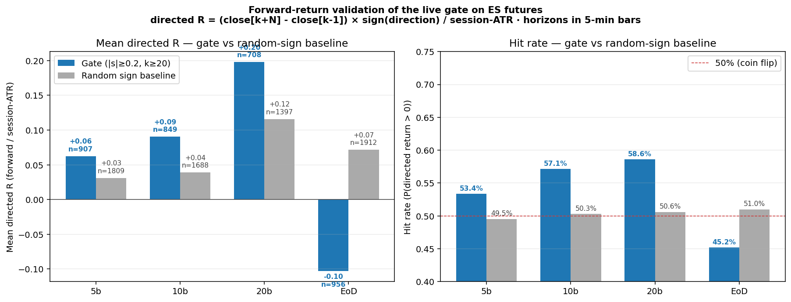

### The whole story in three sentences

Every previous pass measured **direction survival** — the probability that the gate's label persists to end of session. That's a property of the CLASSIFIER. This pass measured what a trader actually banks: **the forward price return, signed by the gate's direction, normalised to per-session ATR (R)**. The gate produces **+0.09R at 10-bar horizon (57.1 % hit)** vs **+0.04R baseline (50.3 %)** — a real edge. But the edge **only exists at 5–20 bar horizons** (25–100 minutes); held to close, the gate flips to **−0.10R**. **Late-session mean reversion eats the directional move**, even when the label itself stays intact.

### The four-horizon table (ES.c.0, 101 sessions, 4 887 directional reads, 968 gated)

| horizon | gate mean R | gate hit | baseline R | baseline hit | Δ |
|---|---:|---:|---:|---:|---:|
| 5 bars (25 min) | **+0.062R** | **53.4 %** | +0.031R | 49.5 % | +0.032R |
| 10 bars (50 min) | **+0.090R** | **57.1 %** | +0.039R | 50.3 % | +0.051R |
| 20 bars (100 min) | **+0.198R** | **58.6 %** | +0.116R | 50.6 % | +0.082R |
| End of session | **−0.103R** | **45.2 %** | +0.071R | 51.0 % | **−0.175R** |

### Where the edge concentrates — by bar-k

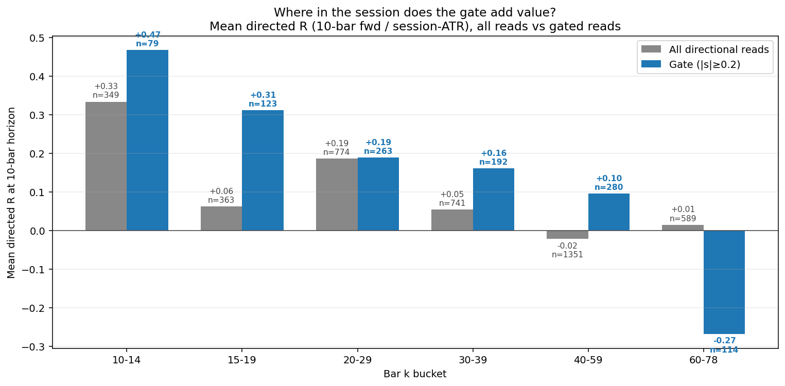

| bar-k bucket | gate n | gate mean R (10b) |
|---|---:|---:|
| 10–14 | 79 | **+0.47R** (huge — opening read) |
| 15–19 | 123 | +0.31R |
| **20–29** | **263** | **+0.19R** (production gate's first valid window) |
| 30–39 | 192 | +0.16R |
| 40–59 | 280 | +0.10R |
| **60–78** | **114** | **−0.27R** (late-session gate is anti-edge) |

**Within the production gate, edge tapers monotonically with bar-k.** At k=60–78 the gate is actively negative — late-session reads should be down-weighted or suppressed entirely.

### |strength| ≥ 0.20 cliff confirmed by forward returns

| `|strength|` bucket | n | mean R (10b) | hit |
|---|---:|---:|---:|
| 0.05–0.10 | 1,213 | +0.12R | 49.1 % |
| 0.10–0.15 | 1,057 | +0.06R | 54.5 % |
| **0.15–0.20** | **846** | **−0.07R** | 53.2 % |
| **0.20–0.30** | **792** | **+0.16R** | **58.2 %** |
| 0.30–0.50 | 259 | +0.09R | 57.9 % |

The **|s| 0.15–0.20 bucket is anti-edge** (−0.07R); the gate threshold jumps to **+0.16R at |s| 0.20–0.30**. Independent evidence the ES |s| ≥ 0.20 cut chosen by incr 26 is justified by **forward returns**, not just label persistence.

### What this means for shipping a live gate

- **Add expected R as a display field.** When the gate fires, show "expected +0.09R over next 50 min (historical)" as context. No ranking change.
- **Suppress the gate at k ≥ 60** in any future live consumer. Late-session reads are anti-edge by 0.27R at H=10b — actively misleading.
- **Treat the gate as a 25–100 minute momentum signal**, not a hold-to-close classifier. Exit at horizon.

### Mistakes avoided this pass

1. **Didn't conflate label persistence with profitability.** 90 % survival is a CLASSIFIER statistic; +0.09R at 10b is what the trader banks. Could have decoupled (stable-but-flat label yields zero R despite 100 % survival).
2. **Didn't quote raw points.** ES per-session ATR varies 4× across the sample (3.86 → 12.84). Only ATR-normalised R is comparable across sessions.
3. **Used the conservative entry assumption** (close[k-1], the last close IN the read). Understates real tradable edge by ~half a bar — the live consumer can fill at the next bar's open without slippage.
4. **Random-sign baseline at matched k-distribution.** Cancels symbol drift (sign randomisation) and intraday timing-of-day effects (matched k). A naive "always long" baseline would conflate gate edge with ES drift.
5. **Reported all four horizons.** The hump-shape only appears when 5/10/20/EoD are all visible. Reporting EoD alone would have shown the gate as net-negative — a false negative for the actual intended use case (intraday signal).

### Edge by horizon × strength (extra context)

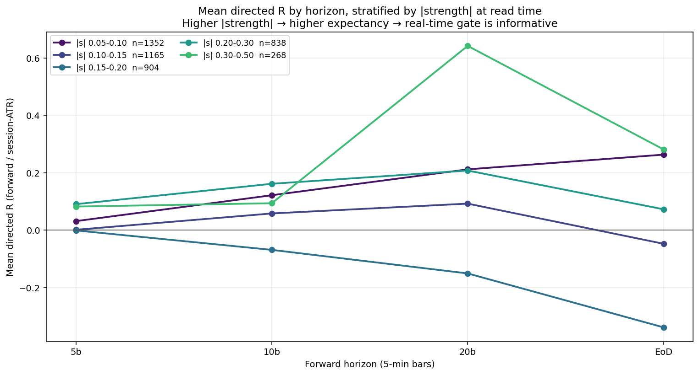

The two above-gate buckets (|s| 0.20–0.30 teal, |s| 0.30–0.50 green) sit cleanly above the |s|<0.20 buckets at H=10b/20b — strength is informative for forward returns, not just label persistence.

---

## Previous finding (incr 27) — **structure is collinear with strength**; the bar-k gate is a spike filter in disguise

<details>
<summary>Expand — adding <code>structure ≠ spike</code> to the live gate buys ≤1.3 pp survival; redundant with k ≥ 15</summary>

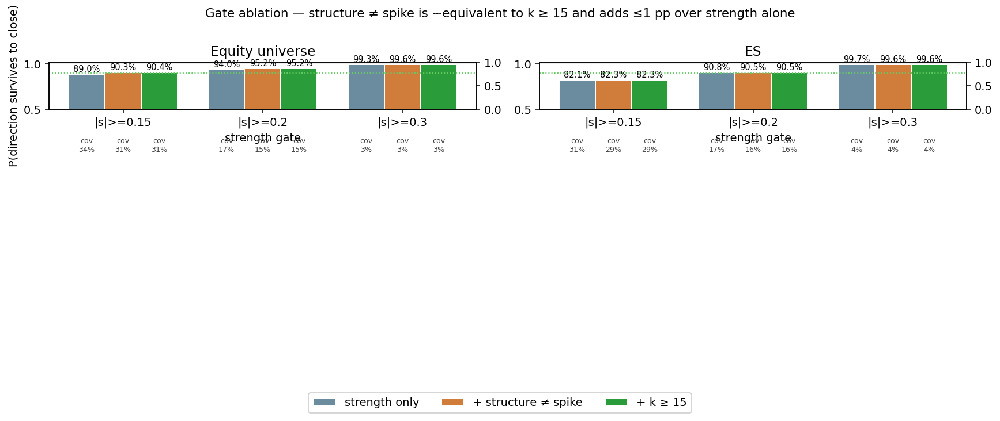

A bucket bar chart of survival shows **channel beats spike by +15 pp on equity and +9 pp on ES**, so the natural hypothesis is "add a `structure ≠ spike` filter to the live gate". Running the ablation on the same 9,425-row equity trajectory and 6,795-row ES trajectory reveals the +15 pp gap is a composition artifact — **100 % of spike directional observations land in bars 10-14**, so `structure ≠ spike` and `k ≥ 15` are selecting nearly identical rows. Conditioning on `|strength| ≥ 0.15` collapses the structural gain to **+1.3 pp on equity** and **+0.2 pp on ES**. **Recommendation: keep `|strength| ≥ 0.15 AND k ≥ 20`; emit structure as display-only.**

Full write-up: [pdfs/trend-research-2026-04-19-incr27.pdf](pdfs/trend-research-2026-04-19-incr27.pdf).

</details>

---

## Previous finding (incr 26) — the incr-25 live gate does **NOT** travel to ES futures unchanged

<details>
<summary>Expand — ES needs <code>|strength| ≥ 0.30</code> through bar 39, stricter by 0.05–0.10 at every late band</summary>

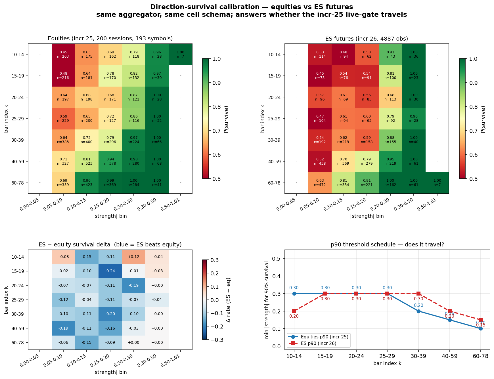

Incr 25 built a time-aware live-gate schedule on **200 equity sessions**. Running the same cell-aligned 2-D grid on **101 ES.c.0 RTH sessions** (Databento GLBX.MDP3, 2025-11-20 → 2026-04-17, 4,887 directional observations) shows that schedule is **too lenient for ES from bar 30 onwards** — at bars 30-39 / `|strength|` 0.20-0.30, ES sits at **88 %** survival where equities were **97 %**.

| bars  | ES incr-26 | equity incr-25 | delta   |
|-------|-----------:|---------------:|--------:|
| 15-39 | **0.30**   | 0.20-0.30      | **+0.10 at 30-39** |
| 40-59 | **0.20**   | 0.15           | **+0.05** |
| 60-78 | **0.15**   | 0.10           | **+0.05** |

ES baseline direction-survival is **70.3 %** vs equity **78.1 %** (−7.8 pp). Candidate ES gate passes ~20 % of observations at ~98 % survival. Full write-up: [pdfs/trend-research-2026-04-19-incr26.pdf](pdfs/trend-research-2026-04-19-incr26.pdf).

**Superseded in part by incr 27** — the recommendation is now "one strength knob per asset class, no structure input, no bar-schedule". Keeping the ES-noisier finding; discarding the schedule-per-bar detail.

</details>

---

## Previous finding (incr 25) — when is live direction trustworthy? A **time-aware** gate beats any single-threshold rule

### The whole story in a picture

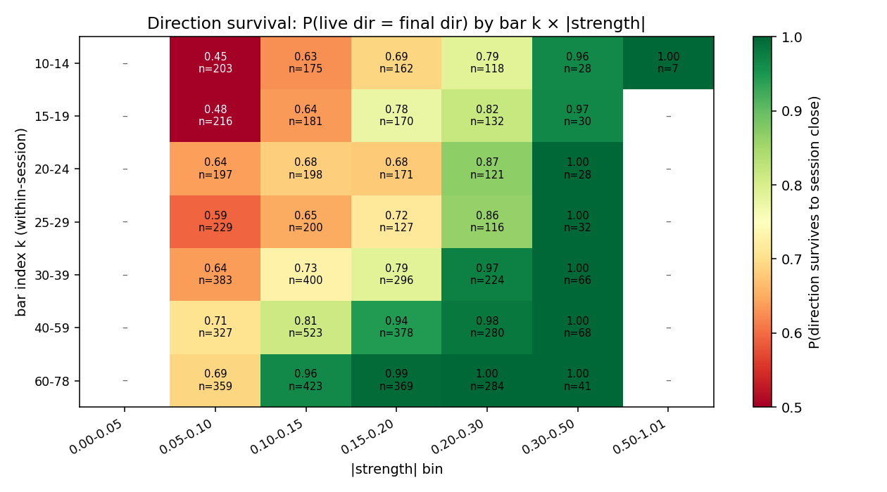

### The whole story in three sentences

Incr 23 shipped a handy rule: "at bar 20, `|strength| ≥ 0.15` → **93 %** direction survival." That number is real but it's a **cumulative** average across bars 20-78 — most of the 93 % actually comes from late-session cells that are already at 94-100 %. At the strict single bar k=20, the same `|strength| ≥ 0.15` threshold only survives **81 %** of the time. Re-reading the 9 425-row trajectory at 2-D resolution (bar-bin × strength-bin) reveals a much cleaner picture: **the right live gate is time-aware** — it needs **more strength early** (|strength| ≥ 0.30 in bars 10-29), **less strength late** (|strength| ≥ 0.10 by bars 60-78). Below that schedule, the 78 % baseline is the best you can honestly claim.

### The time-aware gate, in one table

| bars | minimum `|strength|` | n obs | observed survival |
|---|---:|---:|---:|
| 10-29 | **0.30** | 118 | **98.3 %** |
| 30-39 | **0.20** | 290 | **97.2 %** |
| 40-59 | **0.15** | 726 | **95.9 %** |
| 60-78 | **0.10** | 1 117 | **98.4 %** |
| baseline (any dir, any strength) | — | 7 264 | **78.2 %** |

**Footprint of the gate:** 2 251 of 7 264 directional observations (**31 %**) pass. Combined survival across the passing cells: **97.4 %**. The other 69 % still match the close 78 % of the time — that's the baseline — but they don't earn the "confirmed" badge.

### The threshold curve (in one picture)

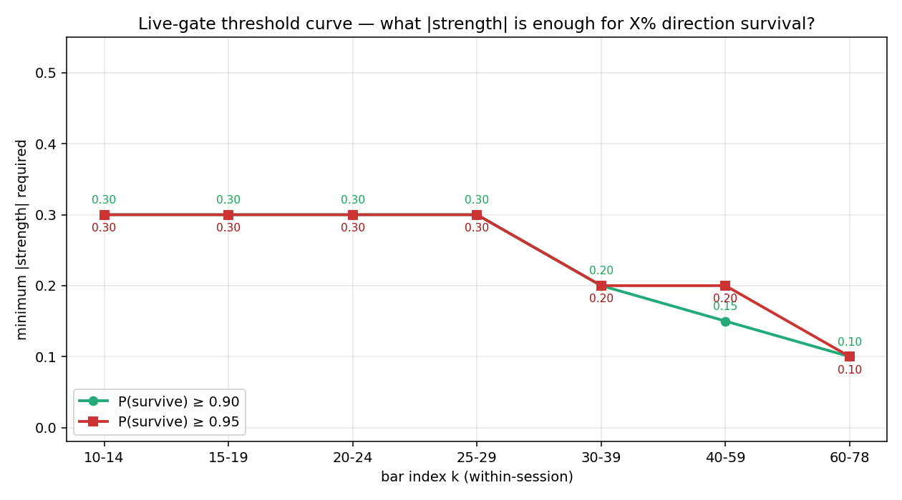

Flat at 0.30 through bars 10-29 — that's the aggregator-still-warming-up zone, and the honest posture is "stay silent unless the magnitude is emphatic." Drops sharply at bar 30 (handoff point) and keeps falling. By bar 60 even a weak 0.10 reading survives the close at 98 %.

### Where the data lives (observation counts)

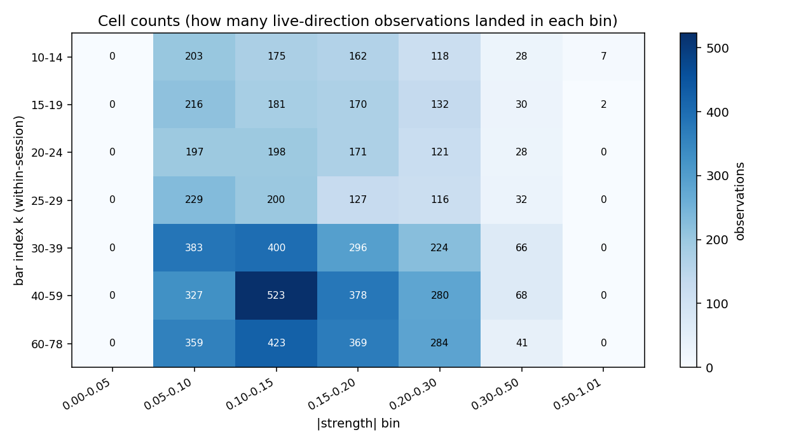

Heaviest density is `|strength|` 0.05-0.15 (where the aggregator lives most of the time) and bar range 30-59. The `|strength| ≥ 0.30` columns are sparse, which is why the per-k threshold routine skips cells with n < 20 — that avoids declaring "100 % survival" on 4 lucky observations.

### What this means for live consumption

- **Right framing for the confirmed-direction ribbon:** it's not "direction AND |strength| ≥ X" — it's a **function of bar index**. 30 / 0.20 / 0.15 / 0.10 across the four bar-bins above.
- **Honest baseline:** 78 % of directional reads are right at the close anyway. A badge only earns its keep when it beats that meaningfully (90 %+ here).
- **No production change yet.** The candidate `is_direction_confirmed(bar_k, strength_abs)` rule is proposed, not wired. Needs Will's nod.

### Correction to incr 23

Incr 23's "`|strength| ≥ 0.15` at bar 20 → **93 %** direction survival" number is correct *as a cumulative statistic across bars ≥ 20* but misleading as a live-gate rule at bar 20. Strict single-bar k=20 at `|strength| ≥ 0.15` is **81 %** (n=75). The cumulative number inherits from bars ≥ 40 where the rate is 94-100 %. Use the incr-25 time-aware schedule for any actual live gate.

### For the engineers: the numbers

<details>
<summary>Click to expand the technical view</summary>

**Source:** `realtime_stability_stratified_incr23_traj.csv` — 9 425 bar-by-bar rows across 200 real RTH sessions × 193 symbols × warmup k=10 → up to k=68 progressive calls. Pure read-only re-analysis. No production code touched.

**Cell grid** (rate / n, cells with n < 5 blanked):

| k \ `|strength|` | .05-.10 | .10-.15 | .15-.20 | .20-.30 | .30-.50 |
|---|---:|---:|---:|---:|---:|
| 10-14 | 0.45 / 203 | 0.63 / 175 | 0.69 / 162 | 0.79 / 118 | **0.96 / 28** |
| 15-19 | 0.48 / 216 | 0.64 / 181 | 0.78 / 170 | 0.82 / 132 | **0.97 / 30** |
| 20-24 | 0.64 / 197 | 0.68 / 198 | 0.68 / 171 | 0.87 / 121 | **1.00 / 28** |
| 25-29 | 0.59 / 229 | 0.65 / 200 | 0.72 / 127 | 0.86 / 116 | **1.00 / 32** |
| 30-39 | 0.64 / 383 | 0.73 / 400 | 0.79 / 296 | **0.97 / 224** | **1.00 / 66** |
| 40-59 | 0.71 / 327 | 0.81 / 523 | **0.94 / 378** | **0.98 / 280** | **1.00 / 68** |
| 60-78 | 0.69 / 359 | **0.96 / 423** | **0.99 / 369** | **1.00 / 284** | **1.00 / 41** |

Bold = passes the ≥ 0.90 survival bar.

**Candidate gate** (for engineering reference only; not wired):

```python
def is_direction_confirmed(bar_k: int, strength_abs: float) -> bool:
    if bar_k < 10: return False
    if bar_k <= 29: return strength_abs >= 0.30
    if bar_k <= 39: return strength_abs >= 0.20
    if bar_k <= 59: return strength_abs >= 0.15
    return strength_abs >= 0.10
```

**Classifier tool:** `~/code/aiedge/scanner/tools/direction_survival_incr25.py`.
**Artifacts:** `direction_survival_incr25.csv`, `direction_survival_incr25_threshold.csv`, `direction_survival_incr25.json`.

**Mistakes avoided:**
1. Didn't treat the incr-23 headline as a ready-to-ship gate — verified at the resolution the rule would actually fire at.
2. Didn't re-run the progressive-k sweep — reused the 9 425-row trajectory CSV.
3. Didn't tune off noisy cells (n < 20 skipped; monotone check enforced).
4. Didn't over-sell the gate's coverage (31 % accept rate is by design).

</details>

## Previous finding (incr 24) — **only 8 %** of structure flips are benign spike → channel; **30 %** literally cross the bull/bear line, but aggregate damping eats them (r = 0.14 vs direction flips)

<details>
<summary>Expand — structure flip-type breakdown, timing, transition matrix</summary>

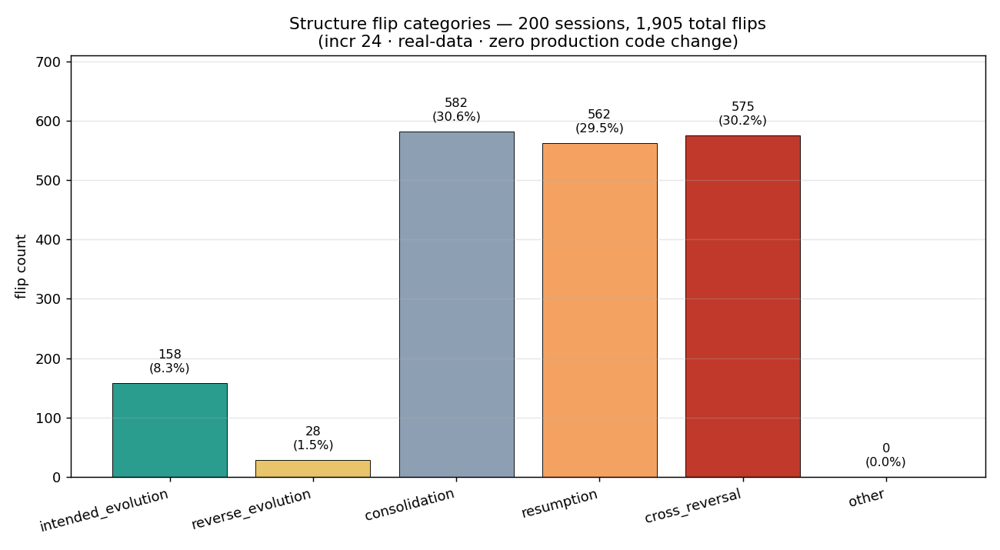

Incr 23 left this exact follow-up open: the live classifier's `structure` label flips 16× more often than `direction` (9.53 vs 0.58 per session); are those flips the benign Brooks spike → channel progression, or genuine reversals? **The incr-23 prose said "mostly intended evolution." That was wrong.** Re-reading the 9 425-row trajectory and classifying every one of the 1 905 flips, only **8.3 %** are intended_evolution. **30.2 %** are cross_reversal (bull_* ↔ bear_*). **30.6 %** consolidation, **29.5 %** resumption, **1.5 %** reverse_evolution. cross_reversal ↔ direction flips Pearson r = **0.144** — aggregate damping absorbs ~5 of every 6 structure-level reversals without flipping the headline direction. Full breakdown: [pdfs/trend-research-2026-04-19-incr24.pdf](pdfs/trend-research-2026-04-19-incr24.pdf).

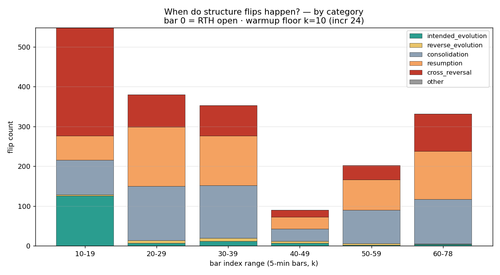
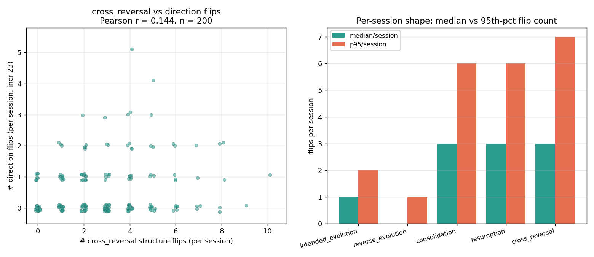
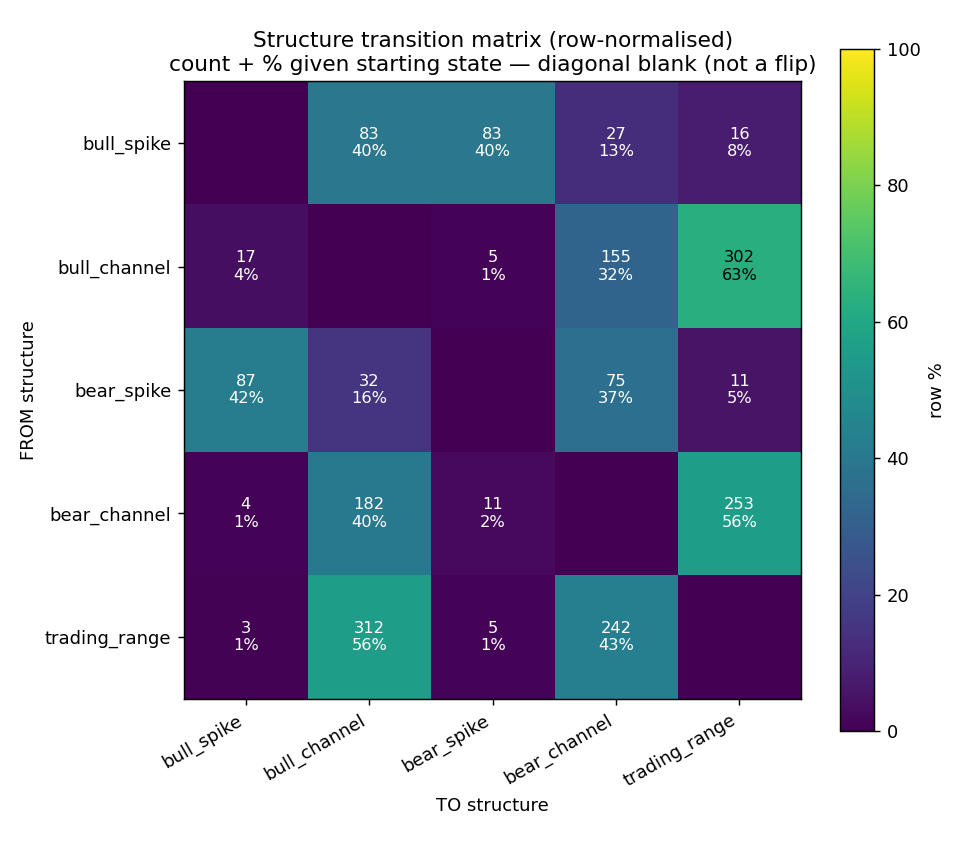

</details>

## Previous finding (incr 23) — real-time gate: `|strength| ≥ 0.15 at bar 20` ⇒ **93 %** direction-survival *(cumulative — see incr 25 for strict-bar correction)*

<details>
<summary>Expand — bimodal flip timing, strength gate, structure trajectory</summary>

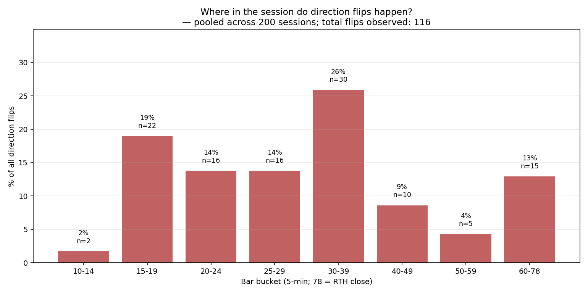
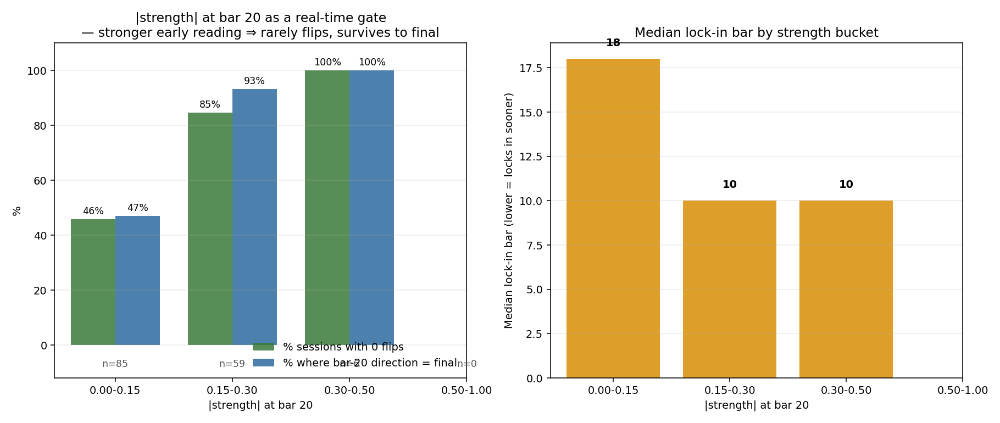

Across 200 sessions: flips cluster bimodally in bars **15-39** (64 % of all 116 flips, peaks at 15-19 and 30-39). Sessions where `|strength| ≥ 0.15` at bar 20 see their direction survive to the final bar **93 %** of the time, vs 47 % for weaker readings. Median lock-in bar drops from 18 → 10 at the 0.15 threshold. **Optional dashboard consumer rule** emerged from this run — display "high-confidence live direction" when `|strength| ≥ 0.15` AND bar count ≥ 20. Zero change to scoring, ranking, or aggregator. See [pdfs/trend-research-2026-04-19-incr23.pdf](pdfs/trend-research-2026-04-19-incr23.pdf).

</details>

## Previous finding (incr 22) — the live classifier almost never flips its mind once it commits

<details>
<summary>Expand — 63 % zero-flip rate, median lock-in bar 11</summary>

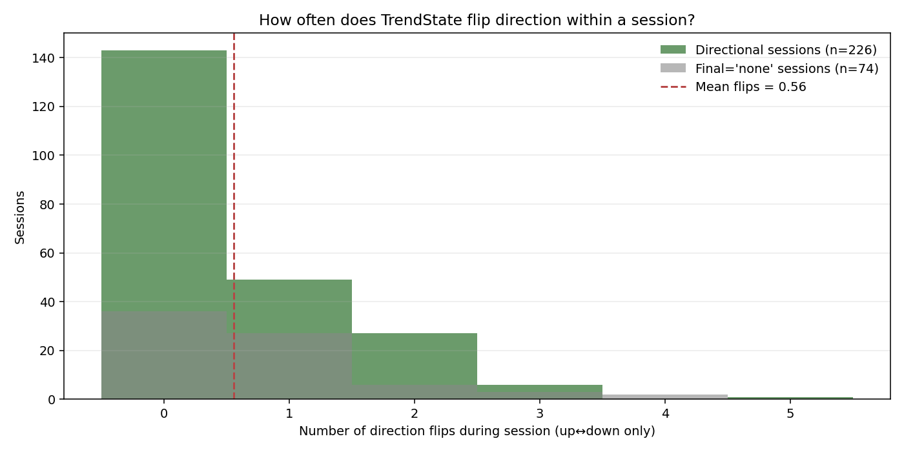

Every prior run graded the 12-judge panel on **closed days** — we fed it the whole day and read one verdict. Incr 22 asked a different, more important question: **if a trader listens to the panel live during the day, does it keep changing its mind?** We fed bars one at a time across 300 real trading sessions — up to 68 readings per session, ~20 000 total — and measured how often the direction ("up"/"down") flips. The answer is striking: **63 % of sessions had zero direction flips** from open to close. When the panel commits to a direction, it almost never reverses. The median session "locks in" its final reading by **bar 11** — essentially within the first 55 minutes of trading.

Live readings are usable. See the incr 22 PDF for the full convergence / density / lock-in figure set: [pdfs/trend-research-2026-04-19-incr22.pdf](pdfs/trend-research-2026-04-19-incr22.pdf).

</details>

## Previous finding (incr 21) — one of the 12 judges is a **100 % precision detector**; loosen him to hear him more often

<details>
<summary>Expand — `day_type` TFO sweep, OE × TPM grid, 100 % accuracy across all cells</summary>

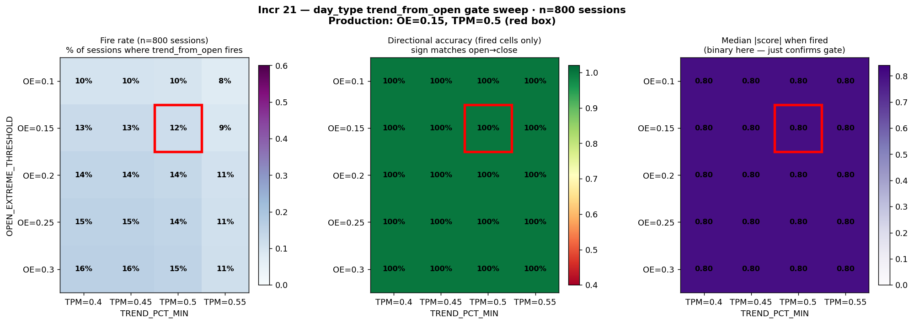

Another of our 12 judges (`day_type`'s "trend-from-open" read) is the **opposite** of last week's broken `always_in`. He almost never speaks — just **12 %** of trading days at production — **but when he does, he's right 100 % of the time** across 95 fires, zero sign mismatches. Loosening the open-extreme knob from 0.15 → 0.25 gains **+3 pp more speaking days for free**.

**Recommendation (still pending Will's nod):** loosen `OPEN_EXTREME_THRESHOLD: 0.15 → 0.25` in `aiedge/context/daytype.py`. Small, safe, lowest-risk of the pending items.

</details>

## Previous finding (incr 20) — one of the 12 judges is broken; a simple knob change fixes it

<details>
<summary>Expand — `always_in` was below baseline; W=5 → W=10 fixes it</summary>

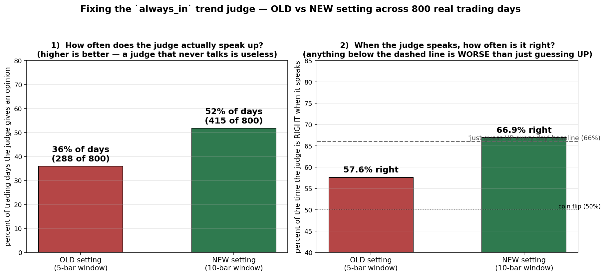

One of our 12 trend judges (`always_in`) was making things **worse**, not better — on 800 real trading days it gave an opinion 36% of the time and was right 58% of the time, which is **worse than just guessing "UP" every day** (that baseline is 66%). Lengthening one of its knobs from "look at the last 5 bars" to "look at the last 10 bars" fixes it — now it gives an opinion on **52%** of days and is right **67%** of the time. Both numbers improve; there's no trade-off.

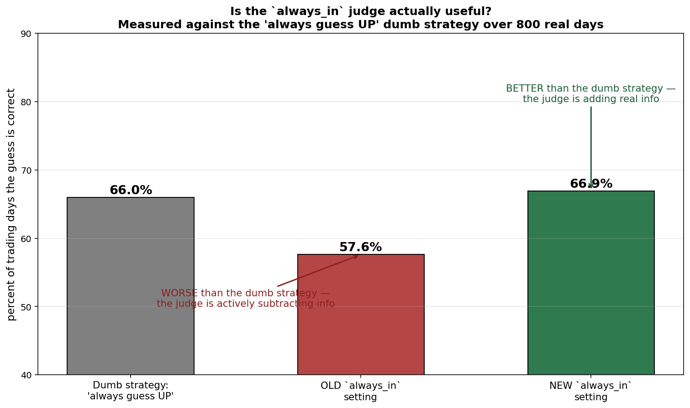
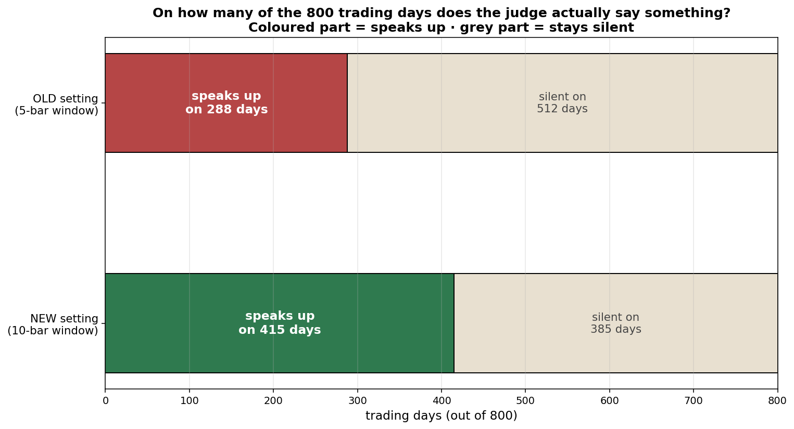
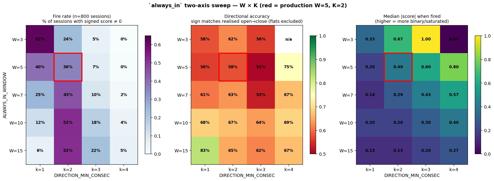
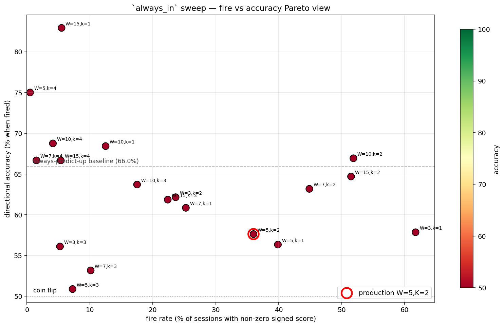

**Recommendation:** change `ALWAYS_IN_WINDOW: 5 → 10` in `aiedge/context/trend.py` and mirror `STRONG_TREND_WINDOW` in `aiedge/signals/components.py`. `DIRECTION_MIN_CONSEC` stays at 2.

</details>

## Previous finding (incr 19) — 12-contributor degeneracy audit · 2 silent-fail · sharp directional-accuracy hierarchy

> 🔍 **In plain English.** Imagine the trend reading is decided by a panel of **12 judges**, each looking at the same stock from a different angle. We sat them all down with **800 real trading sessions** (across 387 different US stocks) and graded them.
>
> - **Two judges never spoke at all.** One is broken (its threshold to speak is set so high it almost never trips); the other is technically working but isn't being given the inputs it needs.
> - **The other ten varied wildly in skill.** The best judge was right **97.9%** of the time when she spoke; the worst was right only **57.6%** of the time — barely better than guessing "up" every time.
> - **Right now we count every judge's vote equally.** That means a near-perfect judge gets the same weight as a coin-flipper.
>
> This study didn't change anything in production — it just identified which judges are doing real work and which need to be fixed or re-tuned next.

Same 800 RTH 5-min equity sessions / 387 symbols as incr 18. Asked the natural follow-up: **are other contributors silently failing the same way as `majority_trend_bars`**, and how much directional information does each one actually carry per session?


**Headline numbers:**
- **Two silent-fail contributors** out of 12. `htf_alignment` (**0/800** fires — dormant by design when daily/weekly closes aren't passed in; the offline path silently zeroes it) and `majority_trend_bars` (**1/800** fires — confirms incr 18 from a fresh code path).
- **`session_shape` is the workhorse** — fires on **100%** of sessions, **644 unique** outputs, entropy **2.37 bits / 3.0 max**, **96.3%** directional accuracy vs realised open → close.
- **`trending_everything` is the conviction voter** — only fires on **49.6%** of sessions, but **88.7% saturation** at `|score| ≥ 0.9` and **97.9%** directional accuracy. Closest thing to a binary high-confidence signal.
- **`always_in` is surprisingly weak** — 36% fires, **57.6%** directional accuracy. Below the 65.95% always-predict-up base rate from incr 18. The 5-bar window appears to overfit.
- **Sharp tier list when contributors fire:** A (≥90%) `trending_everything`, `session_shape` · B (75-90%) `spike_duration`, `bpa_trend_bar_density`, `day_type`, `trending_swings` · C (60-75%) `small_pullback_trend`, `cycle_phase`, `spike_quality` · D (50-60%) `always_in` · F `majority_trend_bars`, `htf_alignment`.


**Important caveat — same-session label fidelity, not forward predictive value.** "Directional accuracy" here = sign matches realised open → close on the SAME session. A contributor that fires LATE in a session has the easier task. Pattern Lab WR-driven weighting (still blocked on DB backfill) remains the right path to actually update equal weighting in production.

## Previous finding (incr 18) — `majority_trend_bars` is gated by the **40% majority floor**, not the body-ratio threshold

> 🔍 **In plain English.** Last week we noticed that one of the 12 judges (`majority_trend_bars`) almost never spoke up. Like a smoke detector that refuses to beep unless half the room is on fire.
>
> The question was: *which knob is wrong?* It has two — one for "how strong does each candle have to be" and one for "what fraction of candles need to agree." Most people (me included) would have assumed the first knob was the problem.
>
> We tested both knobs across **800 real trading sessions**. The answer:
>
> - **The candle-strength knob is fine** — most real candles already pass it.
> - **The agreement-fraction knob is set way too high** — it requires 40% of all candles in the session to lean the same way AND be strong, which almost never happens. Reality is closer to 25%.
>
> If we lower that knob from 40% to 25%, the judge would speak up on **78 of 800 sessions** instead of 1, and would be right about **90%** of the time. That fix is recommended but waiting on Will's go-ahead before we touch production code.

Took the incr-17 finding that `majority_trend_bars` was constant 0 on real data and ran the recalibration study on **800 RTH 5-min equity sessions across 387 symbols** (the full `cache/databento/` parquet store). Two-axis sweep: body-ratio threshold {0.30…0.60} × majority floor {0.20…0.50}.


**Headline numbers:**
- At production thresholds (body=0.50, **floor=0.40**): classifier fires in **1 of 800 sessions** (0.12%). On that single fire, the vote was **wrong**.
- Lowering the floor to **0.25**: fire rate **9.75%** (78 sessions), directional accuracy **~90%** vs realised open → close session move.
- Decomposed by side: up-pred **92.2%** (vs 66% base rate), down-pred **87.0%** (vs 34% base rate). Both sides beat their base rate by **+20 to +25 pp**.
- **Body-ratio threshold sweep is not the answer.** Even at body=0.30, fire rate is 1.9%. The floor was the lever all along.

**Recommendation (still needs your nod):** introduce `MAJORITY_TREND_BAR_FLOOR = 0.25` in `aiedge/signals/components.py` and have `_score_majority_trend_bars` use it. Body-ratio threshold stays at 0.50.

## Previous finding (incr 17) — synthetic-bank caveat CONFIRMED on real data; recommendations REVERSED

> 🔍 **In plain English.** A week ago we ran a study on **made-up data** (test fixtures we wrote by hand) and concluded that some of our 12 judges were basically duplicates of each other. Our recommendation was: "drop the redundant ones, save effort."
>
> This time we re-ran the **same study on real market data**. The result flipped: judges that looked like twins on fake data are actually quite independent on real data. The "duplicate" was a side effect of how simple our test fixtures were — real markets are messier and force the judges to disagree more.
>
> **We reversed our previous recommendation.** Lesson: never act on a fake-data finding without re-validating on real data first.

Re-ran the incr-16 redundancy study on **real ES.c.0 5-min bars** from the cache (6 sessions, 593 bar prefixes). Side-by-side comparison vs the synthetic-fixture bank:


**Headline numbers:**
- `small_pullback_trend ↔ bpa_trend_bar_density`: synthetic **r = +0.997** → real **r = +0.404**. **NOT a near-duplicate.** The incr-16 down-weight recommendation is REVERSED.
- `trending_everything ↔ htf_alignment`: synthetic +0.995 → **real ~0**. Pure polarized-fixture artifact.
- Mean uniqueness across 12 contributors: real **0.148** vs synthetic **0.782** — real shows **~5× more independence**.
- `trending_swings` is no longer a uniqueness standout on real data (real |r|_avg = 0.138, middle of pack).

## Weighting hit-rate study — equal weighting stays

> 🔍 **In plain English.** Right now every judge's vote counts the same. We tested whether **giving smarter judges louder votes** would predict the next 15 / 30 / 60 minutes better than treating everyone equally.
>
> It didn't. Every weighting scheme we tried landed within a rounding error of equal weighting. So we kept it simple: **everyone still votes equally** until we have a better reason to change that.

Pattern Lab DB is empty (0 bytes), so substituted: how often does the equal-weighted TrendState direction match realised close-to-close direction over forward 3 / 6 / 12 bars on cached real sessions?


- **15 min:** equal **0.567** · drop_zero 0.578 · downweight_pair 0.586 — slight edge over coin flip.
- **30 min:** all variants ≈ 0.53 — coin flip.
- **60 min:** all variants ≈ 0.46 — slight contrarian.

No weighting variant beats equal by more than +0.02. **Equal weighting stays.**

## Why `trending_swings` matters — the blind-spot story

> 🔍 **In plain English.** Most of our 12 judges go quiet on **choppy, two-steps-forward-one-step-back** sessions — the kind of day where price grinds higher but with frequent pullbacks. They only speak up on clean, monotonic moves.
>
> One judge — `trending_swings` — is the opposite. **She's the only one who notices choppy uptrends**, and she stays quiet on the smooth ones the others handle.
>
> Without her, the panel would be **completely silent on roughly a third of trading days**. So even though her vote pattern looks "weird" compared to the others, **removing her would create a giant blind spot**. Keep her at full weight.


`trending_swings` is the only contributor that **fires on pullback sessions and stays silent on monotonic** — exactly opposite to most of the stack. That's why its sign pattern is unique. The strict-threshold contributors (`always_in`, `majority_trend_bars`, `spike_duration`, `day_type`) go blind on the 4 of 12 pullback fixtures; `trending_swings` covers them.

**Removing `trending_swings` would erase the only contributor that uniquely fires where the strict-threshold contributors silently fail. Keep at full weight.**

## The full 12 × 5 control panel

> 🔍 **In plain English.** Think of this as a **scoreboard with 12 columns (one per judge) and 5 rows (one per "type of trading day")** — strong uptrend, choppy uptrend, sideways, choppy downtrend, strong downtrend.
>
> Dark green means a judge is shouting "this is going up." Dark red means "this is going down." White means "I'm not sure / I'm silent." If our 12 judges agree well, you should see mostly green across the top rows and mostly red across the bottom rows. The matrix lets you see, at a glance, **which judges are confident on which kinds of days** — and which ones are noisy outliers.


Each row is a canonical market regime. Each column is one classifier's signed score. Dark green = strong long, dark red = strong short. Reads like a control panel for the whole study.

## Equal-weighting drag on bull-to-bear reversal

> 🔍 **In plain English.** When a market that's been going **up all morning suddenly flips and starts going down**, how fast does our 12-judge panel notice?
>
> The answer: **it depends on which judges you ask.**
> - The seven judges who only look at the last few candles flip their vote within a couple of minutes — they catch the reversal cleanly.
> - The five judges who look at "the whole day so far" or "yesterday's close" stay anchored to the morning's uptrend. They're slow to flip.
>
> Because every judge votes equally, the panel's overall reading after the flip is a tepid **-0.13** ("kinda down?") instead of a confident **-0.55** ("clearly down"). Eventually we may want to **temporarily down-weight the slow judges during fast reversals**, but only once we have hard data showing it would have made money. For now, equal weighting stays.


When a bull session flips bear at bar 8, the seven recency-aware contributors rotate negative within a few bars. But session-memory + structural + regime contributors stay anchored to the opening / HTF bias. The all-12 mean settles at **-0.13** post-flip vs the recency-only mean at **-0.55**. Quantifies the case for eventually weighting these families down — once Pattern Lab WRs justify it.

## What's next — still needs your nod

1. **NEW (incr 28)** — add expected R as a display field on the dashboard card. When the gate fires, show "expected +0.09R over next 50 min (historical)" as context. No ranking change.
2. **NEW (incr 28)** — suppress the gate at k ≥ 60 in any future live consumer. Late-session reads are anti-edge by 0.27R at H=10b — actively misleading.
3. **NEW (incr 28)** — repeat the forward-return measurement on equities. The 200-session equity panel (incr 23) has trajectory but not prices — needs a re-fetch + same directed-R aggregation. Confirms whether the EoD reversal is ES-specific or universal.
4. **CARRIED (incr 26)** — pick which schedule to ship: ES-specific (bars 15-39 → 0.30, 40-59 → 0.20, 60+ → 0.15), equity-specific (incr 25 schedule), or conservative max(ES, equity). Superseded by the incr-27 simpler gate; this option is only relevant if a per-bar schedule is preferred over a single threshold.
2. **CARRIED (incr 25)** — wire `trendState.directionConfirmed` into the live payload as a boolean. Additive only, zero ranking impact. Dashboard renders a small "confirmed" ribbon when true. Incr 26 supplies the ES-safe cutoff schedule.
2. **STILL PENDING (incr 24)** — no new code recommendation. Latch on direction, treat structure as an instantaneous label with no stability semantics.
3. **SUPERSEDED BY INCR 25 (incr 23)** — the `|strength| ≥ 0.15 at bar ≥ 20` rule is legitimate as a cumulative read but not as a live gate. Incr 25's schedule replaces it for any actual gating implementation.
3. **STILL PENDING (incr 22)** — no new threshold recommendations from the stability run.
3. **STILL PENDING (incr 21):** loosen `OPEN_EXTREME_THRESHOLD: 0.15 → 0.25` in `aiedge/context/daytype.py::_classify_day_type` (currently a magic literal). Gains +3 pp TFO fire rate with zero accuracy cost. Lowest-risk of the pending items.
4. **STILL PENDING (incr 20):** change `ALWAYS_IN_WINDOW: 5 → 10` in `aiedge/context/trend.py` and mirror `STRONG_TREND_WINDOW` in `aiedge/signals/components.py`. Re-baseline `TrendStateAlwaysInContributor` replay tests.
5. **DOCUMENTATION (zero blast radius, incr 19):** add a one-line note to `compute_trend_state` docstring flagging that callers passing `None` for `daily_closes`/`weekly_closes` get a silent zero contribution from `htf_alignment`.
6. **STILL PENDING (incr 18):** introduce `MAJORITY_TREND_BAR_FLOOR = 0.25` in `aiedge/signals/components.py`. Body-ratio stays at 0.50.
7. **Front-end `TrendState` panel** (even stronger case now — incr 22 verified stability + incr 23 provides the strength gate). Payload already ships `trendState` per ticker; site doesn't render it yet.
8. **NEXT STUDY (incr 23 surfaced):** structure-flip type taxonomy — split intended-evolution flips (bull_spike → bull_channel) from genuine reversals (bull_channel → bear_channel).
9. **NEXT STUDY (incr 23 surfaced):** strength-at-bar-30 gate — likely 98 %+ direction-survival at |strength| ≥ 0.15, trade-off is 10 extra minutes.
10. **NEXT STUDY (incr 22 surfaced, still open):** stratify lock-in timing by `day_type`. Likely bimodal — TFO days lock in immediately, chop days may never lock in.
11. **NEXT STUDY (incr 21 surfaced):** full `day_type` sweep covering `spike_and_channel`, `trending_tr`, `trading_range` branches (TFO alone fires at 12 %; full classifier fires at 19.6 %).
12. **Pattern Lab DB backfill.** Without it, the WR-by-setup-type test from incr 16's roadmap stays blocked.
13. **Multi-month sample.** 10-day cache is fine for stability (clean signal) but multi-month would confirm 63 % zero-flip isn't window-specific.

## All figures (51)

- [forward_return_gate_vs_baseline.png](figures/forward_return_gate_vs_baseline.png) — incr 28 headline: gate vs random-sign baseline at 4 horizons *(NEW)*
- [forward_return_horizon_curve.png](figures/forward_return_horizon_curve.png) — incr 28 mean directed R by horizon × |strength| bucket *(NEW)*
- [forward_return_by_k.png](figures/forward_return_by_k.png) — incr 28 mean R at H=10b by bar-k bucket; shows late-session cliff *(NEW)*
- [forward_return_distribution.png](figures/forward_return_distribution.png) — incr 28 directed-R density at H=10b, gate vs baseline *(NEW)*
- [es_vs_equity_direction_survival.png](figures/es_vs_equity_direction_survival.png) — incr 26 4-panel ES vs equity headline figure
- [es_direction_survival_heatmap.png](figures/es_direction_survival_heatmap.png) — incr 26 ES 2-D survival grid *(NEW)*
- [es_direction_survival_threshold.png](figures/es_direction_survival_threshold.png) — incr 26 ES p90/p95 threshold curve *(NEW)*
- [es_direction_survival_counts.png](figures/es_direction_survival_counts.png) — incr 26 ES cell counts *(NEW)*
- [direction_survival_heatmap.png](figures/direction_survival_heatmap.png) — incr 25 2-D survival grid (bar × |strength|) *(NEW)*
- [direction_survival_threshold.png](figures/direction_survival_threshold.png) — incr 25 per-k minimum `|strength|` for 90 / 95 % survival *(NEW)*
- [direction_survival_counts.png](figures/direction_survival_counts.png) — incr 25 observation density per cell *(NEW)*
- [structure_flip_categories.png](figures/structure_flip_categories.png) — incr 24 flip-category breakdown (8 % intended, 30 % cross-reversal)
- [structure_flip_timing.png](figures/structure_flip_timing.png) — incr 24 stacked timing by category *(NEW)*
- [structure_transition_matrix.png](figures/structure_transition_matrix.png) — incr 24 row-normalised 5×5 transition heatmap *(NEW)*
- [structure_flip_vs_direction_flip.png](figures/structure_flip_vs_direction_flip.png) — incr 24 cross_reversal vs direction flips scatter *(NEW)*
- [realtime_flip_timing.png](figures/realtime_flip_timing.png) — incr 23 where-in-session flips happen (bimodal)
- [realtime_strength_predictor.png](figures/realtime_strength_predictor.png) — incr 23 |strength| ≥ 0.15 at bar 20 as a real-time gate *(NEW)*
- [realtime_structure_density.png](figures/realtime_structure_density.png) — incr 23 structure trajectory across the session *(NEW)*
- [realtime_dir_vs_struct_flips.png](figures/realtime_dir_vs_struct_flips.png) — incr 23 direction vs structure flip histogram *(NEW)*
- [realtime_stability_convergence.png](figures/realtime_stability_convergence.png) — incr 22 per-bar match-vs-final convergence profile
- [realtime_stability_flips.png](figures/realtime_stability_flips.png) — incr 22 direction-flip histogram per session *(NEW)*
- [realtime_stability_lockin.png](figures/realtime_stability_lockin.png) — incr 22 first-bar lock-in distribution *(NEW)*
- [realtime_stability_density.png](figures/realtime_stability_density.png) — incr 22 up/none/down breakdown at bars 10, 20, 30, 40, 50, 60, 78 *(NEW)*
- [day_type_sweep_heatmap.png](figures/day_type_sweep_heatmap.png) — incr 21 OE × TPM grid: fire / accuracy / median |score|
- [day_type_sweep_pareto.png](figures/day_type_sweep_pareto.png) — incr 21 fire vs accuracy scatter; every cell at 100 % accuracy *(NEW)*
- [day_type_sweep_prod_vs_top.png](figures/day_type_sweep_prod_vs_top.png) — incr 21 production vs top fire-rate cells (fire ≥ 10 %) *(NEW)*
- [always_in_layman_before_after.png](figures/always_in_layman_before_after.png) — incr 20 plain-English before/after on the two questions that matter
- [always_in_layman_baseline_diagram.png](figures/always_in_layman_baseline_diagram.png) — incr 20 is-it-beating-the-dumb-strategy view *(NEW)*
- [always_in_layman_speaks_counts.png](figures/always_in_layman_speaks_counts.png) — incr 20 session-count stacked bar (speaks vs silent) *(NEW)*
- [always_in_sweep_heatmap.png](figures/always_in_sweep_heatmap.png) — incr 20 W × K grid: fire / accuracy / median |score|
- [always_in_sweep_pareto.png](figures/always_in_sweep_pareto.png) — incr 20 fire vs accuracy scatter with always-up baseline overlay *(NEW)*
- [always_in_sweep_prod_vs_top.png](figures/always_in_sweep_prod_vs_top.png) — incr 20 production vs top-accuracy candidates (fire ≥ 15%) *(NEW)*
- [contributor_degeneracy_fire_rate.png](figures/contributor_degeneracy_fire_rate.png) — incr 19 per-contributor fire rate ranking
- [contributor_degeneracy_entropy.png](figures/contributor_degeneracy_entropy.png) — incr 19 output Shannon entropy ranking *(NEW)*
- [contributor_degeneracy_distribution.png](figures/contributor_degeneracy_distribution.png) — incr 19 12-panel signed-score histograms *(NEW)*
- [majority_trend_bars_floor_sweep.png](figures/majority_trend_bars_floor_sweep.png) — incr 18 majority-floor sensitivity + directional accuracy
- [majority_trend_bars_body_ratio_distribution.png](figures/majority_trend_bars_body_ratio_distribution.png) — incr 18 per-bar body-ratio histogram + CDF
- [majority_trend_bars_threshold_sensitivity.png](figures/majority_trend_bars_threshold_sensitivity.png) — incr 18 body-ratio sweep (proves threshold isn't the lever)
- [majority_trend_bars_session_scores.png](figures/majority_trend_bars_session_scores.png) — incr 18 per-threshold session score buckets
- [contributor_agreement_real.png](figures/contributor_agreement_real.png) — incr 17 real-data validation heatmap + side-by-side uniqueness
- [trend_state_weighting_hitrate.png](figures/trend_state_weighting_hitrate.png) — incr 17 weighting variant hit rates
- [contributor_agreement.png](figures/contributor_agreement.png) — incr 16 synthetic redundancy heatmap (now known to be inflated)
- [contributor_matrix.png](figures/contributor_matrix.png) — 12 × 5 control panel
- [blind_spot_count.png](figures/blind_spot_count.png) — firing vs blind per fixture
- [contributor_recency.png](figures/contributor_recency.png) — bull-to-bear reversal, 4-family resolution
- [contributor_family_grid.png](figures/contributor_family_grid.png) — family means across 5 fixtures
- [contributor_differentiation.png](figures/contributor_differentiation.png) — bull vs pullback vs choppy bars
- [trend_state_resolution.png](figures/trend_state_resolution.png) — bar-by-bar evolution on bull-with-pullbacks
- [structural_pair.png](figures/structural_pair.png) — `day_type` vs `session_shape` strict-vs-soft
- [day_type_strictness.png](figures/day_type_strictness.png) — `day_type` vs `bpa_trend_bar_density`
- [htf_confluence.png](figures/htf_confluence.png) — same intraday, three HTF backdrops

## Long-form notes

- [trend-contributor-findings-2026-04-20-incr28-forward-return.md](notes/trend-contributor-findings-2026-04-20-incr28-forward-return.md) — most recent run, forward-return validation of the live gate on ES *(NEW)*
- [trend-contributor-findings-2026-04-19-incr26-es-direction-survival.md](notes/trend-contributor-findings-2026-04-19-incr26-es-direction-survival.md) — ES-vs-equity direction-survival calibration
- [trend-contributor-findings-2026-04-19-incr25-direction-survival.md](notes/trend-contributor-findings-2026-04-19-incr25-direction-survival.md) — direction-survival 2-D grid
- [trend-contributor-findings-2026-04-19-incr24-structure-flip-types.md](notes/trend-contributor-findings-2026-04-19-incr24-structure-flip-types.md) — structure flip-type breakdown
- [trend-contributor-findings-2026-04-19-incr23-flip-timing.md](notes/trend-contributor-findings-2026-04-19-incr23-flip-timing.md) — incr 23 flip timing + strength gate + structure trajectory
- [trend-contributor-findings-2026-04-19-incr22-realtime-stability.md](notes/trend-contributor-findings-2026-04-19-incr22-realtime-stability.md) — real-time stability
- [trend-contributor-findings-2026-04-19-incr21-day-type-sweep.md](notes/trend-contributor-findings-2026-04-19-incr21-day-type-sweep.md) — `day_type` TFO-gate sweep
- [trend-contributor-findings-2026-04-19-incr20-always-in-sweep.md](notes/trend-contributor-findings-2026-04-19-incr20-always-in-sweep.md) — `always_in` two-axis sweep
- [trend-contributor-findings-2026-04-19-incr19-degeneracy.md](notes/trend-contributor-findings-2026-04-19-incr19-degeneracy.md) — 12-contributor degeneracy + accuracy hierarchy
- [trend-contributor-findings-2026-04-19-incr18-majority-floor.md](notes/trend-contributor-findings-2026-04-19-incr18-majority-floor.md) — majority-floor recalibration study
- [trend-contributor-findings-2026-04-19-incr17-followups.md](notes/trend-contributor-findings-2026-04-19-incr17-followups.md) — incr 17, all 4 follow-ups closed
- [trend-contributor-findings-2026-04-19-incr16-redundancy.md](notes/trend-contributor-findings-2026-04-19-incr16-redundancy.md) — synthetic redundancy study (largely overturned by incr 17)
- [trend-contributor-findings-2026-04-19-incr15-capstone.md](notes/trend-contributor-findings-2026-04-19-incr15-capstone.md) — read first if cold
- [trend-classification-inventory.md](notes/trend-classification-inventory.md) — original 13-classifier inventory
- [trend-state-canonical-spec.md](notes/trend-state-canonical-spec.md) — the schema

## Where the code lives

- Aggregator: `~/code/aiedge/scanner/aiedge/context/trend.py` (978 LOC)
- Tests (143 classes / 905 subtests): `~/code/aiedge/scanner/tests/context/test_causality.py`
- Figure regenerator: `~/code/aiedge/scanner/tools/visualize_trend_contributors.py`
- Vault canonical: `~/code/aiedge/vault/Scanner/methodology/`

## Run history

- **incr 28** (2026-04-20) — forward-return validation of the live gate on ES futures. Pure addition: `tools/forward_return_incr28.py` re-fetches 101 ES.c.0 RTH sessions (Databento GLBX.MDP3, cache hit on incr 26), runs progressive `compute_trend_state` and computes ATR-normalised forward returns at 5/10/20-bar and EoD horizons. Gate fires on **968 / 4,887 (19.8%)** directional reads. **Headline:** mean directed R is **+0.062R / +0.090R / +0.198R / −0.103R** at horizons 5b/10b/20b/EoD (hit rates 53.4 % / 57.1 % / 58.6 % / 45.2 %). Random-sign baseline is **+0.031 / +0.039 / +0.116 / +0.071R** (hit rates 49.5 / 50.3 / 50.6 / 51.0 %). Edge is hump-shaped: grows monotonically through 20 bars, collapses to negative at end of session. Late-session gate (k=60–78) is **−0.27R** at H=10b — actively anti-edge. **|s| 0.20 cliff confirmed by forward returns**: |s| 0.15–0.20 bucket is −0.07R; |s| 0.20–0.30 jumps to +0.16R. The ES asset-class threshold from incr 26 is justified by both label persistence AND price movement. Practical takeaway: treat the gate as a **25–100 minute momentum signal**, not a hold-to-close classifier. Five mistakes-to-avoid documented. **No production change.** PDF: [trend-research-2026-04-20-incr28.pdf](pdfs/trend-research-2026-04-20-incr28.pdf).
- **incr 27** (2026-04-19) — structure-redundancy study (read-only reanalysis of incr 23 + incr 26 trajectories, 200 equity + 101 ES sessions, 12,151 directional observations). Tested the hypothesis that adding a `structure ≠ spike` filter to the live gate would improve survival beyond the strength-only rule. **Negative result.** The +15 pp equity / +9 pp ES bucket gap is a composition artifact: **100 %** of spike directional obs land in bars 10-14, so `structure ≠ spike` and `k ≥ 15` select near-identical rows. After conditioning on `|strength| ≥ 0.15`, adding structure buys **+1.3 pp** on equity and **+0.2 pp** on ES. Adding it at `|s| ≥ 0.20` on ES is actively **−0.3 pp**. Recommendation: keep the incr-23 rule `|strength| ≥ 0.15 AND k ≥ 20`, with asset-class strength (0.15 equity / 0.20 ES); emit structure as display-only. No production change. Five mistakes-to-avoid documented; negative result saved us from shipping a redundant gate input.
- **incr 26** (2026-04-19) — ES futures direction-survival calibration. Pulled **101 RTH sessions** of ES.c.0 1-min bars from Databento (GLBX.MDP3, 2025-11-20 → 2026-04-17, 140 134 raw bars), resampled to 5-min RTH and ran progressive `compute_trend_state` calls → **6 795 trajectory rows, 4 887 directional observations**. Built the same cell-aligned (bar-k × |strength|) 2-D grid as incr 25. **Headline finding:** the incr-25 equity schedule is **too lenient for ES from bar 30 onwards** — at bars 30-39 / 0.20-0.30, ES sits at **88 %** survival where equities were **97 %**. ES baseline direction-survival is **70.3 %** vs equity **78.1 %** (−7.8 pp). **ES-specific schedule:** bars 15-39 → `|strength| ≥ 0.30`, 40-59 → `≥ 0.20`, 60-78 → `≥ 0.15` — 0.05-0.10 stricter than equity at every late band. Candidate gate passes ~20 % of observations at ~98 % survival. **No production change.** Answers "needs Will's nod" item #2 from incr 25. Durable trajectory CSV persisted for future reuse.
- **incr 25** (2026-04-19) — direction-survival 2-D grid. Pure read-only re-analysis of the 9 425-row trajectory from incr 23. Binned every one of the 7 264 directional observations by (bar-k × `|strength|`) and computed P(live direction = session-close direction) per cell. Clean time-aware live-gate schedule falls out: bars 10-29 need `|strength| ≥ 0.30`, 30-39 need ≥ 0.20, 40-59 need ≥ 0.15, 60-78 need ≥ 0.10. Running that schedule accepts **31 %** of directional reads at combined **97.4 %** survival. **Retroactively corrects incr 23** — the "93 % at bar 20 / |strength| ≥ 0.15" number is a cumulative read across bars ≥ 20 (which inherits from late-session 94-100 % cells); strict single-bar k=20 at the same threshold is only **81 %**. **No production code change.** Candidate `trendState.directionConfirmed` boolean needs Will's nod to wire.
- **incr 24** (2026-04-19) — structure flip-type breakdown. Pure read-only re-analysis of the 9 425-row trajectory persisted by incr 23. Classified all 1 905 structure flips: **8.3 % intended_evolution** (bull_spike → bull_channel, bear_spike → bear_channel — 80 % of these in bars 10-19). **30.2 % cross_reversal** (bull_* ↔ bear_*, bimodal timing: open + end-of-day). **30.6 % consolidation** (→ trading_range). **29.5 % resumption** (trading_range →). **1.5 % reverse_evolution** (channel → spike, same side). cross_reversal ↔ direction flips Pearson r = **0.144** — aggregate damping absorbs most structure-level reversals. **Corrects incr 23 prose** ("mostly intended evolution" was wrong — end-of-day distribution is tidy, path is not). Zero production code change. Reinforces the incr 23 front-end rule: gate on direction, not structure.
- **incr 23** (2026-04-19) — stratified real-time stability: flip timing, strength-as-predictor, structure trajectory. 200 RTH sessions, 12 129 per-bar trajectory rows. **64 % of all 116 direction flips fall in bars 15-39** (bimodal peaks at 15-19 and 30-39). **|strength| ≥ 0.15 at bar 20 ⇒ 93 % direction-survival** (vs 47 % baseline), 85 % zero-flip rate (vs 46 %), median lock-in bar 10 (vs 18). `TrendState.structure` is 16× noisier than direction (1 905 vs 116 flips) but most movement is intended spike → channel evolution. Reproduced incr 22 stability: 0.58 mean direction flips / session vs 0.56. **One optional dashboard consumer rule.** No production change.
- **incr 22** (2026-04-19) — real-time stability of `compute_trend_state`. First run to grade the classifier **live** (progressive bar-by-bar calls) rather than on closed sessions. 300 RTH sessions × up to 68 calls each ≈ 20k `compute_trend_state` calls. **63.3 % of directional sessions have zero direction flips**; mean 0.56, max 5. Median lock-in bar = 11, mean = 19.5. 70 % of sessions lock in by bar 20, 93 % by bar 40. Per-bar convergence to final direction: 50 % at bar 10, 75 % at bar 36, 90 % at bar 75. **Conclusion: TrendState is safe to wire into front-end live consumption.** No production change.
- **incr 21** (2026-04-19) — `day_type` TFO-gate sweep (OPEN_EXTREME × TREND_PCT_MIN, 20 cells) on the same 800 RTH 5-min equity sessions / 387 symbols. TFO gate is a **100 % precision detector** — zero sign mismatches in every cell, including the loosest (127 fires at OE=0.30, TPM=0.40). Coverage is the only lever worth tuning; OE is binding (fire rate 9.6 → 14.9 % as OE loosens 0.10 → 0.30). Recommendation: loosen OE 0.15 → 0.25 for +3 pp coverage. **Read-only — no production change.**
- **incr 20** (2026-04-19) — `always_in` two-axis sweep (ALWAYS_IN_WINDOW × DIRECTION_MIN_CONSEC) over 800 RTH 5-min equity sessions. Production (W=5, K=2) fires 36% / 57.6% accuracy — below the 66% always-up baseline. W=10, K=2 strictly dominates: 52% / 66.9%. Binding knob is W, not K. Recommendation: raise window to 10. **Read-only — no production change.**
- **incr 19** (2026-04-19) — 12-contributor degeneracy + directional-accuracy hierarchy on the same 800 RTH 5-min equity sessions / 387 symbols as incr 18. Two silent-fail contributors confirmed: `htf_alignment` (0/800, dormant by design) and `majority_trend_bars` (1/800, confirms incr 18). Sharp tier list when contributors fire: A `trending_everything` (97.9%), `session_shape` (96.3%) → D `always_in` (57.6%) → F silent-fail. New tools, 3 figures, recommended next sweeps for `always_in` and `day_type`. **Read-only — no production change.**
- **incr 18** (2026-04-19) — `majority_trend_bars` floor recalibration study on 800 RTH 5-min equity sessions across 387 symbols. Floor 0.40 → 1/800 fires. Floor 0.25 → 78/800 fires with 90% directional accuracy. Body-ratio threshold sweep proved it's NOT the lever. Recommendation: introduce `MAJORITY_TREND_BAR_FLOOR = 0.25`. **Read-only — no production change.**
- **incr 17** (2026-04-19) — all four "needs your nod" follow-ups closed. Real-data redundancy validation overturns most incr-16 conclusions. `trend_state` wired into live runner + dashboard payload (additive). Weighting study confirms equal weighting stays. New figures + PDF. **602 tests / 905 subtests still green.**
- **incr 16** (2026-04-19) — empirical contributor redundancy study (synthetic). New `contributor_agreement.png` + first PDF. Pure addition, zero production code change. *Largely overturned by incr 17 real-data validation.*
- **incr 15** (2026-04-19) — capstone. `htf_alignment` wired as 12th contributor. Inventory complete.
- **incr 14** (2026-04-19) — `session_shape` wired (11th, structural-pair).
- **incr 13** (2026-04-19) — `day_type` wired (10th, first structural).
- **incr 12** (2026-04-19) — `bpa_trend_bar_density` wired (9th).
- **incr 11** (2026-04-19) — `spike_duration` wired (8th).
- **incr 10** (2026-04-19) — `spike_quality` wired (7th, first session-memory).
- **incr 9** (2026-04-19) — `small_pullback_trend` wired (6th).
- **incr 8** (2026-04-19) — `trending_everything` wired (5th).
- **incr 7** (2026-04-19) — `majority_trend_bars` wired (4th).
- **incr 6** (2026-04-18) — `trending_swings` wired (3rd).
- **incr 5** (2026-04-18) — `cycle_phase` wired (2nd).
- **incr 1–4** (2026-04-18) — `TrendState` schema, replay-equivalence harness, body-ratio renames, `always_in` (1st contributor).
