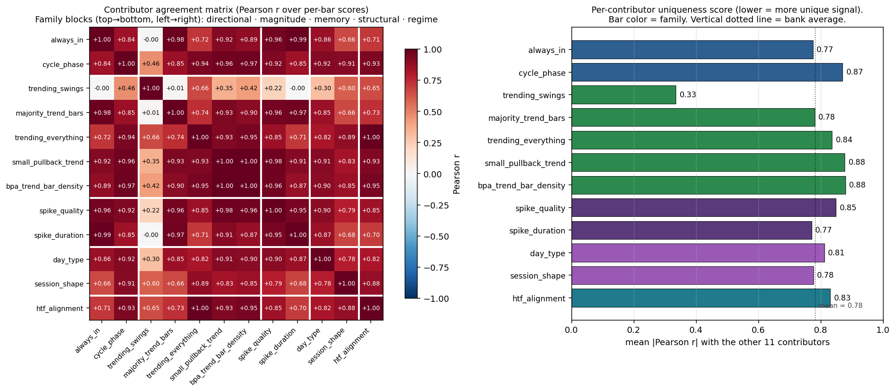

# Trend classification — current state

**Last updated:** 2026-04-19 · **Latest run:** increment 16 (contributor redundancy study)

📄 **[Download this run's PDF](pdfs/trend-research-2026-04-19-incr16.pdf)** — same headline findings, phone-readable.

## TL;DR

The `aiedge-scanner` had **13 parallel "trend-ish" classifiers** doing overlapping work. We've unified them into one canonical `TrendState` that aggregates **12 direction-voting contributors** across **5 families** (directional · magnitude · session-memory · structural · regime). The 13th inventory entry — the regime *amplifier* family — is formally excluded as a stratifier, not a direction voter.

**Status:** inventory complete, 143 test classes / 905 subtests green, zero look-ahead bias, **zero production consumers yet** — the dashboard payload still doesn't read `TrendState`. That wiring needs your nod.

## Most recent finding (incr 16) — `trending_swings` is the only independent voter

Pairwise Pearson r between every pair of the 12 contributors, computed over a per-bar bank of all 5 fixtures (~130 rows):

**What you're looking at:**
- **Left:** 12×12 correlation heatmap. Contributors grouped by family (white separator lines). Red = move together, blue = move opposite.
- **Right:** per-contributor uniqueness (mean |r| with the other 11). Lower bar = more independent signal. Vertical dotted line = bank average (0.79).

**Headline numbers:**
- `trending_swings` |r|_avg = **0.34** — only contributor below the bank average. Less than half the next-best.
- `small_pullback_trend` ↔ `bpa_trend_bar_density` correlate at **r = +0.997** — near-duplicate votes. Same-family, both per-bar trend-bar density at heart. Strongest candidate to either down-weight as a unit or drop one once Pattern Lab WRs decide.
- 11 of 12 contributors sit at |r|_avg between 0.77 and 0.88 — equal weighting is silently double-counting most of the stack.

**Caveat called out loudly:** several cross-family near-perfect correlations (e.g. `trending_everything` ↔ `htf_alignment` = +0.995) are sample-bank artifacts of polarized synthetic fixtures + confluent HTF pairing. **Real-data validation is the next step before any weight change.**

## Why `trending_swings` matters — the blind-spot story

`trending_swings` is the only contributor that **fires on pullback sessions and stays silent on monotonic** — exactly opposite to most of the stack. That's why its sign pattern is unique. The strict-threshold contributors (`always_in`, `majority_trend_bars`, `spike_duration`, `day_type`) go blind on the 4 of 12 pullback fixtures; `trending_swings` covers them.

**Removing `trending_swings` would erase the only contributor that uniquely fires where the strict-threshold contributors silently fail. Keep at full weight.**

## The full 12 × 5 control panel

Each row is a canonical market regime. Each column is one classifier's signed score. Dark green = strong long, dark red = strong short. Reads like a control panel for the whole study.

## Equal-weighting drag on bull-to-bear reversal

When a bull session flips bear at bar 8, the seven recency-aware contributors rotate negative within a few bars. But session-memory + structural + regime contributors stay anchored to the opening / HTF bias. The all-12 mean settles at **-0.13** post-flip vs the recency-only mean at **-0.55**. Quantifies the case for eventually weighting these families down — once Pattern Lab WRs justify it.

## What's next — needs your nod

1. **Emit `trend_state` into the dashboard payload.** Additive but visible.
2. **Wire real daily/weekly close history into the pipeline** so `htf_alignment` isn't dormant in production.
3. **Pattern Lab WR-driven weighting decision** — start by testing whether down-weighting the `small_pullback_trend` ↔ `bpa_trend_bar_density` near-duplicate pair improves WR.
4. **Real-data redundancy validation** — re-run the incr-16 study on a backtest sample of real intraday sessions to confirm the synthetic-bank findings.

## All figures (10)

- [contributor_agreement.png](figures/contributor_agreement.png) — incr 16 redundancy heatmap + uniqueness ranking *(NEW)*
- [contributor_matrix.png](figures/contributor_matrix.png) — 12 × 5 control panel
- [blind_spot_count.png](figures/blind_spot_count.png) — firing vs blind per fixture
- [contributor_recency.png](figures/contributor_recency.png) — bull-to-bear reversal, 4-family resolution
- [contributor_family_grid.png](figures/contributor_family_grid.png) — family means across 5 fixtures
- [contributor_differentiation.png](figures/contributor_differentiation.png) — bull vs pullback vs choppy bars
- [trend_state_resolution.png](figures/trend_state_resolution.png) — bar-by-bar evolution on bull-with-pullbacks
- [structural_pair.png](figures/structural_pair.png) — `day_type` vs `session_shape` strict-vs-soft
- [day_type_strictness.png](figures/day_type_strictness.png) — `day_type` vs `bpa_trend_bar_density`
- [htf_confluence.png](figures/htf_confluence.png) — same intraday, three HTF backdrops

## Long-form notes

- [trend-contributor-findings-2026-04-19-incr15-capstone.md](notes/trend-contributor-findings-2026-04-19-incr15-capstone.md) — read first if cold
- [trend-contributor-findings-2026-04-19-incr16-redundancy.md](notes/trend-contributor-findings-2026-04-19-incr16-redundancy.md) — most recent run
- [trend-classification-inventory.md](notes/trend-classification-inventory.md) — original 13-classifier inventory
- [trend-state-canonical-spec.md](notes/trend-state-canonical-spec.md) — the schema

## Where the code lives

- Aggregator: `~/code/aiedge/scanner/aiedge/context/trend.py` (978 LOC)
- Tests (143 classes / 905 subtests): `~/code/aiedge/scanner/tests/context/test_causality.py`
- Figure regenerator: `~/code/aiedge/scanner/tools/visualize_trend_contributors.py`
- Vault canonical: `~/code/aiedge/vault/Scanner/methodology/`

## Run history

- **incr 16** (2026-04-19) — empirical contributor redundancy study. New `contributor_agreement.png` + first PDF (`pdfs/trend-research-2026-04-19-incr16.pdf`). Pure addition, zero production code change.
- **incr 15** (2026-04-19) — capstone. `htf_alignment` wired as 12th contributor. Inventory complete.
- **incr 14** (2026-04-19) — `session_shape` wired (11th, structural-pair).
- **incr 13** (2026-04-19) — `day_type` wired (10th, first structural).
- **incr 12** (2026-04-19) — `bpa_trend_bar_density` wired (9th).
- **incr 11** (2026-04-19) — `spike_duration` wired (8th).
- **incr 10** (2026-04-19) — `spike_quality` wired (7th, first session-memory).
- **incr 9** (2026-04-19) — `small_pullback_trend` wired (6th).
- **incr 8** (2026-04-19) — `trending_everything` wired (5th).
- **incr 7** (2026-04-19) — `majority_trend_bars` wired (4th).
- **incr 6** (2026-04-18) — `trending_swings` wired (3rd).
- **incr 5** (2026-04-18) — `cycle_phase` wired (2nd).
- **incr 1–4** (2026-04-18) — `TrendState` schema, replay-equivalence harness, body-ratio renames, `always_in` (1st contributor).
