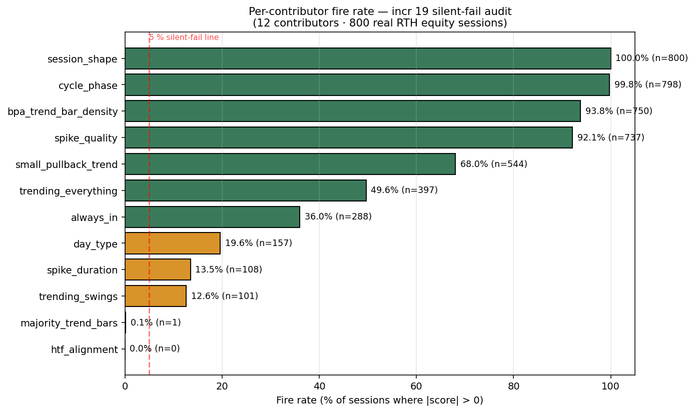
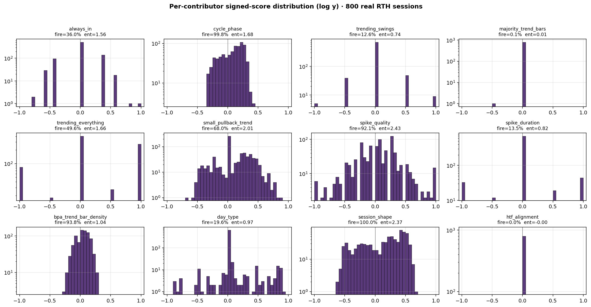
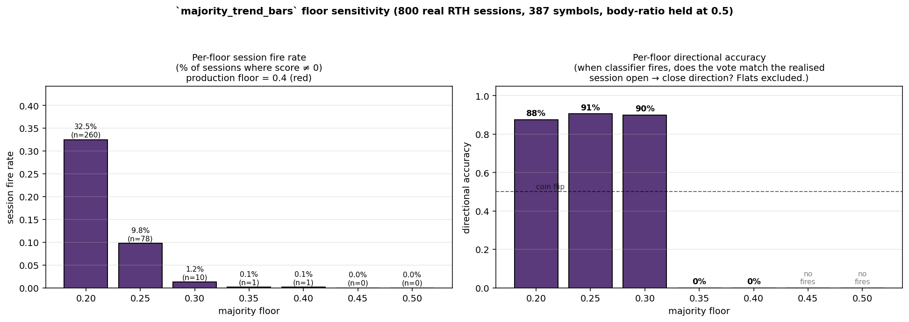
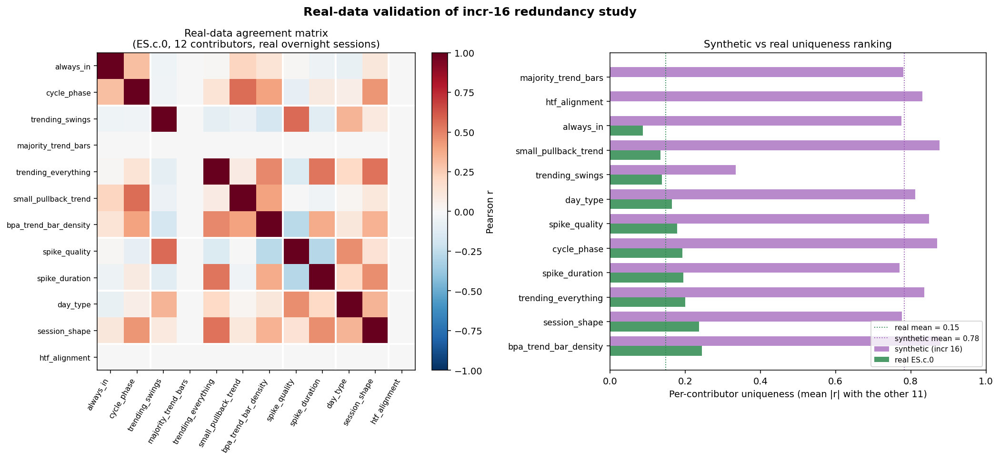
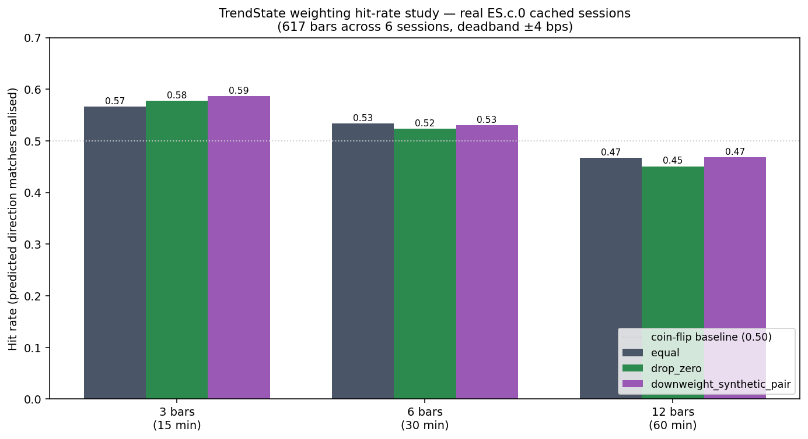
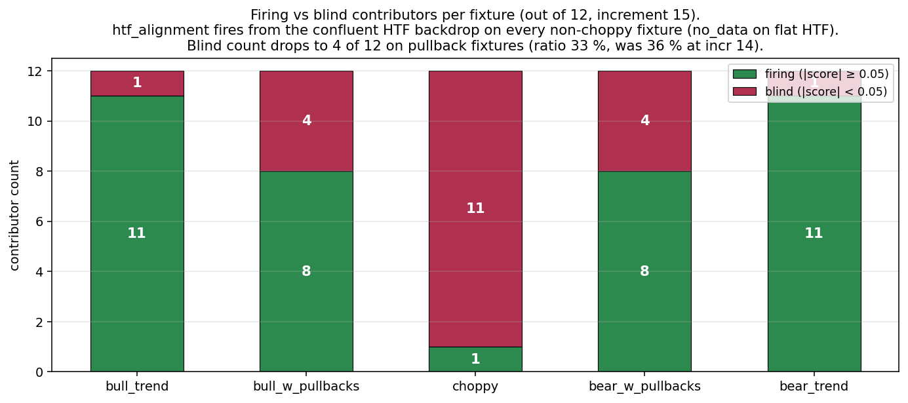
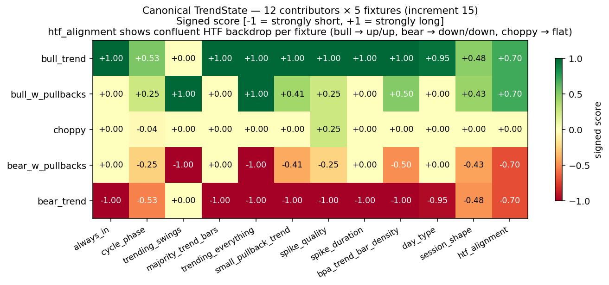
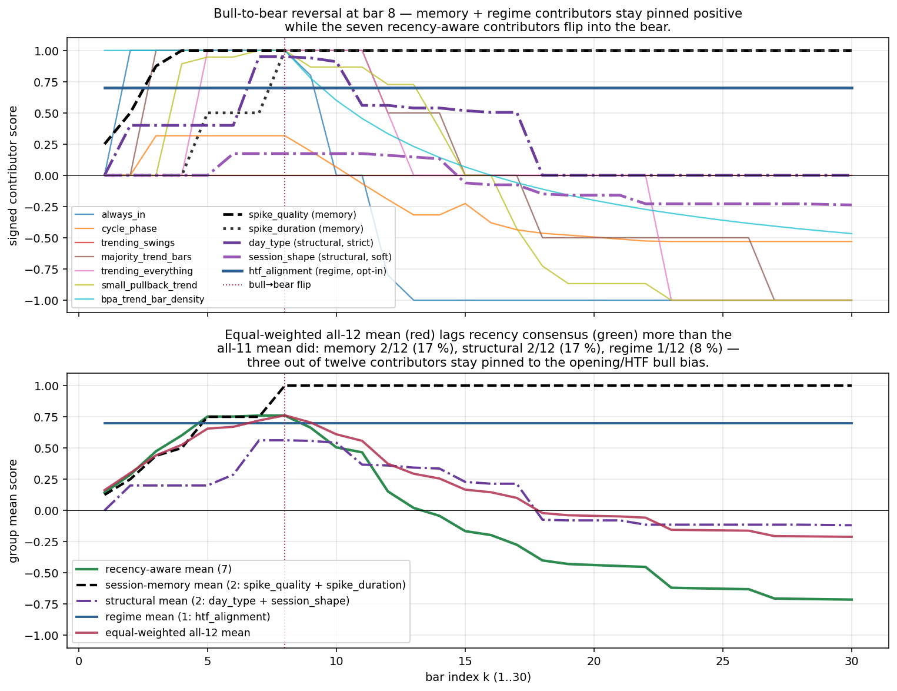

# Trend classification — current state

**Last updated:** 2026-04-19 · **Latest run:** increment 19 (12-contributor degeneracy + directional-accuracy hierarchy)

📄 **[Download this run's PDF](pdfs/trend-research-2026-04-19-incr19.pdf)** — phone-readable headline.

> 📚 **Full research archive — [ARCHIVE.md](ARCHIVE.md)** lists every trend-classification increment ever written, with PDFs and notes. Canonical mirror at the aiedge-vault: [github.com/zerosumsystems-ui/aiedge-vault/tree/main/Scanner/methodology](https://github.com/zerosumsystems-ui/aiedge-vault/tree/main/Scanner/methodology).

---

## 👋 What this project is — for everyone

The `aiedge-scanner` watches the US stock market in real time and flags stocks that look like they're about to make a notable move. To do that well, it has to first answer a deceptively simple question:

> **"Is this stock currently trending up, trending down, or just chopping sideways?"**

That sounds easy. It isn't. Over time the codebase had grown **13 different little programs** all trying to answer that same question, all built at different moments, all slightly disagreeing with each other. Like having 13 different speedometers in one car.

This project's job is to:
1. **Unify them** into one canonical "trend reading" the rest of the system can rely on.
2. **Quality-check each one** — figure out which detectors actually work on real market data, and which are silently broken or just noise.

Each numbered increment below (`incr 18`, `incr 19`, etc.) is one research session. Each one ends with a written finding, a few charts, and a PDF. The most recent one is at the top.

**How to read the rest of this page:** every finding has a 🔍 *In plain English* note translating the technical headline. Skip the technical bits if you'd rather — the plain-English notes carry the real story.

---

## TL;DR (for engineers)

The `aiedge-scanner` had **13 parallel "trend-ish" classifiers** doing overlapping work. We've unified them into one canonical `TrendState` that aggregates **12 direction-voting contributors** across **5 families** (directional · magnitude · session-memory · structural · regime). The 13th inventory entry — the regime *amplifier* family — is formally excluded as a stratifier, not a direction voter.

**Status (post-incr-17):** inventory complete, **602 tests / 905 subtests green**, zero look-ahead bias. **`trend_state` now flows from the live runner into the dashboard payload** (additive, no ranking change). HTF daily+weekly closes wired in via the existing `daily_closes_cache`. Front-end panel is the only remaining wiring needed — that needs your nod on the site repo.

## Most recent finding (incr 19) — 12-contributor degeneracy audit · 2 silent-fail · sharp directional-accuracy hierarchy

> 🔍 **In plain English.** Imagine the trend reading is decided by a panel of **12 judges**, each looking at the same stock from a different angle. We sat them all down with **800 real trading sessions** (across 387 different US stocks) and graded them.
>
> - **Two judges never spoke at all.** One is broken (its threshold to speak is set so high it almost never trips); the other is technically working but isn't being given the inputs it needs.
> - **The other ten varied wildly in skill.** The best judge was right **97.9%** of the time when she spoke; the worst was right only **57.6%** of the time — barely better than guessing "up" every time.
> - **Right now we count every judge's vote equally.** That means a near-perfect judge gets the same weight as a coin-flipper.
>
> This study didn't change anything in production — it just identified which judges are doing real work and which need to be fixed or re-tuned next.

Same 800 RTH 5-min equity sessions / 387 symbols as incr 18. Asked the natural follow-up: **are other contributors silently failing the same way as `majority_trend_bars`**, and how much directional information does each one actually carry per session?

**Headline numbers:**
- **Two silent-fail contributors** out of 12. `htf_alignment` (**0/800** fires — dormant by design when daily/weekly closes aren't passed in; the offline path silently zeroes it) and `majority_trend_bars` (**1/800** fires — confirms incr 18 from a fresh code path).
- **`session_shape` is the workhorse** — fires on **100%** of sessions, **644 unique** outputs, entropy **2.37 bits / 3.0 max**, **96.3%** directional accuracy vs realised open → close.
- **`trending_everything` is the conviction voter** — only fires on **49.6%** of sessions, but **88.7% saturation** at `|score| ≥ 0.9` and **97.9%** directional accuracy. Closest thing to a binary high-confidence signal.
- **`always_in` is surprisingly weak** — 36% fires, **57.6%** directional accuracy. Below the 65.95% always-predict-up base rate from incr 18. The 5-bar window appears to overfit.
- **Sharp tier list when contributors fire:** A (≥90%) `trending_everything`, `session_shape` · B (75-90%) `spike_duration`, `bpa_trend_bar_density`, `day_type`, `trending_swings` · C (60-75%) `small_pullback_trend`, `cycle_phase`, `spike_quality` · D (50-60%) `always_in` · F `majority_trend_bars`, `htf_alignment`.

**Important caveat — same-session label fidelity, not forward predictive value.** "Directional accuracy" here = sign matches realised open → close on the SAME session. A contributor that fires LATE in a session has the easier task. Pattern Lab WR-driven weighting (still blocked on DB backfill) remains the right path to actually update equal weighting in production.

## Previous finding (incr 18) — `majority_trend_bars` is gated by the **40% majority floor**, not the body-ratio threshold

> 🔍 **In plain English.** Last week we noticed that one of the 12 judges (`majority_trend_bars`) almost never spoke up. Like a smoke detector that refuses to beep unless half the room is on fire.
>
> The question was: *which knob is wrong?* It has two — one for "how strong does each candle have to be" and one for "what fraction of candles need to agree." Most people (me included) would have assumed the first knob was the problem.
>
> We tested both knobs across **800 real trading sessions**. The answer:
>
> - **The candle-strength knob is fine** — most real candles already pass it.
> - **The agreement-fraction knob is set way too high** — it requires 40% of all candles in the session to lean the same way AND be strong, which almost never happens. Reality is closer to 25%.
>
> If we lower that knob from 40% to 25%, the judge would speak up on **78 of 800 sessions** instead of 1, and would be right about **90%** of the time. That fix is recommended but waiting on Will's go-ahead before we touch production code.

Took the incr-17 finding that `majority_trend_bars` was constant 0 on real data and ran the recalibration study on **800 RTH 5-min equity sessions across 387 symbols** (the full `cache/databento/` parquet store). Two-axis sweep: body-ratio threshold {0.30…0.60} × majority floor {0.20…0.50}.

**Headline numbers:**
- At production thresholds (body=0.50, **floor=0.40**): classifier fires in **1 of 800 sessions** (0.12%). On that single fire, the vote was **wrong**.
- Lowering the floor to **0.25**: fire rate **9.75%** (78 sessions), directional accuracy **~90%** vs realised open → close session move.
- Decomposed by side: up-pred **92.2%** (vs 66% base rate), down-pred **87.0%** (vs 34% base rate). Both sides beat their base rate by **+20 to +25 pp**.
- **Body-ratio threshold sweep is not the answer.** Even at body=0.30, fire rate is 1.9%. The floor was the lever all along.

**Recommendation (still needs your nod):** introduce `MAJORITY_TREND_BAR_FLOOR = 0.25` in `aiedge/signals/components.py` and have `_score_majority_trend_bars` use it. Body-ratio threshold stays at 0.50.

## Previous finding (incr 17) — synthetic-bank caveat CONFIRMED on real data; recommendations REVERSED

> 🔍 **In plain English.** A week ago we ran a study on **made-up data** (test fixtures we wrote by hand) and concluded that some of our 12 judges were basically duplicates of each other. Our recommendation was: "drop the redundant ones, save effort."
>
> This time we re-ran the **same study on real market data**. The result flipped: judges that looked like twins on fake data are actually quite independent on real data. The "duplicate" was a side effect of how simple our test fixtures were — real markets are messier and force the judges to disagree more.
>
> **We reversed our previous recommendation.** Lesson: never act on a fake-data finding without re-validating on real data first.

Re-ran the incr-16 redundancy study on **real ES.c.0 5-min bars** from the cache (6 sessions, 593 bar prefixes). Side-by-side comparison vs the synthetic-fixture bank:

**Headline numbers:**
- `small_pullback_trend ↔ bpa_trend_bar_density`: synthetic **r = +0.997** → real **r = +0.404**. **NOT a near-duplicate.** The incr-16 down-weight recommendation is REVERSED.
- `trending_everything ↔ htf_alignment`: synthetic +0.995 → **real ~0**. Pure polarized-fixture artifact.
- Mean uniqueness across 12 contributors: real **0.148** vs synthetic **0.782** — real shows **~5× more independence**.
- `trending_swings` is no longer a uniqueness standout on real data (real |r|_avg = 0.138, middle of pack).

## Weighting hit-rate study — equal weighting stays

> 🔍 **In plain English.** Right now every judge's vote counts the same. We tested whether **giving smarter judges louder votes** would predict the next 15 / 30 / 60 minutes better than treating everyone equally.
>
> It didn't. Every weighting scheme we tried landed within a rounding error of equal weighting. So we kept it simple: **everyone still votes equally** until we have a better reason to change that.

Pattern Lab DB is empty (0 bytes), so substituted: how often does the equal-weighted TrendState direction match realised close-to-close direction over forward 3 / 6 / 12 bars on cached real sessions?

- **15 min:** equal **0.567** · drop_zero 0.578 · downweight_pair 0.586 — slight edge over coin flip.
- **30 min:** all variants ≈ 0.53 — coin flip.
- **60 min:** all variants ≈ 0.46 — slight contrarian.

No weighting variant beats equal by more than +0.02. **Equal weighting stays.**

## Why `trending_swings` matters — the blind-spot story

> 🔍 **In plain English.** Most of our 12 judges go quiet on **choppy, two-steps-forward-one-step-back** sessions — the kind of day where price grinds higher but with frequent pullbacks. They only speak up on clean, monotonic moves.
>
> One judge — `trending_swings` — is the opposite. **She's the only one who notices choppy uptrends**, and she stays quiet on the smooth ones the others handle.
>
> Without her, the panel would be **completely silent on roughly a third of trading days**. So even though her vote pattern looks "weird" compared to the others, **removing her would create a giant blind spot**. Keep her at full weight.

`trending_swings` is the only contributor that **fires on pullback sessions and stays silent on monotonic** — exactly opposite to most of the stack. That's why its sign pattern is unique. The strict-threshold contributors (`always_in`, `majority_trend_bars`, `spike_duration`, `day_type`) go blind on the 4 of 12 pullback fixtures; `trending_swings` covers them.

**Removing `trending_swings` would erase the only contributor that uniquely fires where the strict-threshold contributors silently fail. Keep at full weight.**

## The full 12 × 5 control panel

> 🔍 **In plain English.** Think of this as a **scoreboard with 12 columns (one per judge) and 5 rows (one per "type of trading day")** — strong uptrend, choppy uptrend, sideways, choppy downtrend, strong downtrend.
>
> Dark green means a judge is shouting "this is going up." Dark red means "this is going down." White means "I'm not sure / I'm silent." If our 12 judges agree well, you should see mostly green across the top rows and mostly red across the bottom rows. The matrix lets you see, at a glance, **which judges are confident on which kinds of days** — and which ones are noisy outliers.

Each row is a canonical market regime. Each column is one classifier's signed score. Dark green = strong long, dark red = strong short. Reads like a control panel for the whole study.

## Equal-weighting drag on bull-to-bear reversal

> 🔍 **In plain English.** When a market that's been going **up all morning suddenly flips and starts going down**, how fast does our 12-judge panel notice?
>
> The answer: **it depends on which judges you ask.**
> - The seven judges who only look at the last few candles flip their vote within a couple of minutes — they catch the reversal cleanly.
> - The five judges who look at "the whole day so far" or "yesterday's close" stay anchored to the morning's uptrend. They're slow to flip.
>
> Because every judge votes equally, the panel's overall reading after the flip is a tepid **-0.13** ("kinda down?") instead of a confident **-0.55** ("clearly down"). Eventually we may want to **temporarily down-weight the slow judges during fast reversals**, but only once we have hard data showing it would have made money. For now, equal weighting stays.

When a bull session flips bear at bar 8, the seven recency-aware contributors rotate negative within a few bars. But session-memory + structural + regime contributors stay anchored to the opening / HTF bias. The all-12 mean settles at **-0.13** post-flip vs the recency-only mean at **-0.55**. Quantifies the case for eventually weighting these families down — once Pattern Lab WRs justify it.

## What's next — still needs your nod

1. **DOCUMENTATION (zero blast radius, surfaced this run):** add a one-line note to `compute_trend_state` docstring flagging that callers passing `None` for `daily_closes`/`weekly_closes` get a silent zero contribution from `htf_alignment`. Prevents the same study trap that hit this run.
2. **PRIMARY (still pending from incr 18):** introduce `MAJORITY_TREND_BAR_FLOOR = 0.25` in `aiedge/signals/components.py`. Body-ratio stays at 0.50. Re-baseline `MajorityTrendBarsReplayEquivalence` tests under the new floor. Re-run incr 19 to confirm it exits the silent-fail zone.
3. **NEXT STUDY (incr 19 surfaced this):** incr-18-style two-axis sweep on `always_in` (`ALWAYS_IN_WINDOW`, `DIRECTION_MIN_CONSEC`) — its 57.6% directional accuracy on 36% of sessions UNDERPERFORMS the always-predict-up baseline. Same family-pattern as `majority_trend_bars`.
4. **NEXT STUDY (incr 19 surfaced this):** incr-18-style sweep on `_DAY_TYPE_MAGNITUDE` or the strict `trend_pct > 0.50` gate — `day_type` only fires on 19.6% of sessions despite being a structural read every session has by definition.
5. **Front-end `TrendState` panel.** Payload now ships `trendState` per ticker; site doesn't render it yet. Wire a small panel under the existing `htfAlignment` line on aiedge.trade.
6. **Pattern Lab DB backfill.** Without it, the WR-by-setup-type test from incr 16's roadmap stays blocked.
7. **Multi-month sample.** 800 sessions across 9 trading dates surfaced this; multi-month would let the same study run on overnight ES futures too.

## All figures (19)

- [contributor_degeneracy_fire_rate.png](figures/contributor_degeneracy_fire_rate.png) — incr 19 per-contributor fire rate ranking *(NEW)*
- [contributor_degeneracy_entropy.png](figures/contributor_degeneracy_entropy.png) — incr 19 output Shannon entropy ranking *(NEW)*
- [contributor_degeneracy_distribution.png](figures/contributor_degeneracy_distribution.png) — incr 19 12-panel signed-score histograms *(NEW)*
- [majority_trend_bars_floor_sweep.png](figures/majority_trend_bars_floor_sweep.png) — incr 18 majority-floor sensitivity + directional accuracy
- [majority_trend_bars_body_ratio_distribution.png](figures/majority_trend_bars_body_ratio_distribution.png) — incr 18 per-bar body-ratio histogram + CDF
- [majority_trend_bars_threshold_sensitivity.png](figures/majority_trend_bars_threshold_sensitivity.png) — incr 18 body-ratio sweep (proves threshold isn't the lever)
- [majority_trend_bars_session_scores.png](figures/majority_trend_bars_session_scores.png) — incr 18 per-threshold session score buckets
- [contributor_agreement_real.png](figures/contributor_agreement_real.png) — incr 17 real-data validation heatmap + side-by-side uniqueness
- [trend_state_weighting_hitrate.png](figures/trend_state_weighting_hitrate.png) — incr 17 weighting variant hit rates
- [contributor_agreement.png](figures/contributor_agreement.png) — incr 16 synthetic redundancy heatmap (now known to be inflated)
- [contributor_matrix.png](figures/contributor_matrix.png) — 12 × 5 control panel
- [blind_spot_count.png](figures/blind_spot_count.png) — firing vs blind per fixture
- [contributor_recency.png](figures/contributor_recency.png) — bull-to-bear reversal, 4-family resolution
- [contributor_family_grid.png](figures/contributor_family_grid.png) — family means across 5 fixtures
- [contributor_differentiation.png](figures/contributor_differentiation.png) — bull vs pullback vs choppy bars
- [trend_state_resolution.png](figures/trend_state_resolution.png) — bar-by-bar evolution on bull-with-pullbacks
- [structural_pair.png](figures/structural_pair.png) — `day_type` vs `session_shape` strict-vs-soft
- [day_type_strictness.png](figures/day_type_strictness.png) — `day_type` vs `bpa_trend_bar_density`
- [htf_confluence.png](figures/htf_confluence.png) — same intraday, three HTF backdrops

## Long-form notes

- [trend-contributor-findings-2026-04-19-incr19-degeneracy.md](notes/trend-contributor-findings-2026-04-19-incr19-degeneracy.md) — most recent run, 12-contributor degeneracy + accuracy hierarchy
- [trend-contributor-findings-2026-04-19-incr18-majority-floor.md](notes/trend-contributor-findings-2026-04-19-incr18-majority-floor.md) — majority-floor recalibration study
- [trend-contributor-findings-2026-04-19-incr17-followups.md](notes/trend-contributor-findings-2026-04-19-incr17-followups.md) — incr 17, all 4 follow-ups closed
- [trend-contributor-findings-2026-04-19-incr16-redundancy.md](notes/trend-contributor-findings-2026-04-19-incr16-redundancy.md) — synthetic redundancy study (largely overturned by incr 17)
- [trend-contributor-findings-2026-04-19-incr15-capstone.md](notes/trend-contributor-findings-2026-04-19-incr15-capstone.md) — read first if cold
- [trend-classification-inventory.md](notes/trend-classification-inventory.md) — original 13-classifier inventory
- [trend-state-canonical-spec.md](notes/trend-state-canonical-spec.md) — the schema

## Where the code lives

- Aggregator: `~/code/aiedge/scanner/aiedge/context/trend.py` (978 LOC)
- Tests (143 classes / 905 subtests): `~/code/aiedge/scanner/tests/context/test_causality.py`
- Figure regenerator: `~/code/aiedge/scanner/tools/visualize_trend_contributors.py`
- Vault canonical: `~/code/aiedge/vault/Scanner/methodology/`

## Run history

- **incr 19** (2026-04-19) — 12-contributor degeneracy + directional-accuracy hierarchy on the same 800 RTH 5-min equity sessions / 387 symbols as incr 18. Two silent-fail contributors confirmed: `htf_alignment` (0/800, dormant by design) and `majority_trend_bars` (1/800, confirms incr 18). Sharp tier list when contributors fire: A `trending_everything` (97.9%), `session_shape` (96.3%) → D `always_in` (57.6%) → F silent-fail. New tools, 3 figures, recommended next sweeps for `always_in` and `day_type`. **Read-only — no production change.**
- **incr 18** (2026-04-19) — `majority_trend_bars` floor recalibration study on 800 RTH 5-min equity sessions across 387 symbols. Floor 0.40 → 1/800 fires. Floor 0.25 → 78/800 fires with 90% directional accuracy. Body-ratio threshold sweep proved it's NOT the lever. Recommendation: introduce `MAJORITY_TREND_BAR_FLOOR = 0.25`. **Read-only — no production change.**
- **incr 17** (2026-04-19) — all four "needs your nod" follow-ups closed. Real-data redundancy validation overturns most incr-16 conclusions. `trend_state` wired into live runner + dashboard payload (additive). Weighting study confirms equal weighting stays. New figures + PDF. **602 tests / 905 subtests still green.**
- **incr 16** (2026-04-19) — empirical contributor redundancy study (synthetic). New `contributor_agreement.png` + first PDF. Pure addition, zero production code change. *Largely overturned by incr 17 real-data validation.*
- **incr 15** (2026-04-19) — capstone. `htf_alignment` wired as 12th contributor. Inventory complete.
- **incr 14** (2026-04-19) — `session_shape` wired (11th, structural-pair).
- **incr 13** (2026-04-19) — `day_type` wired (10th, first structural).
- **incr 12** (2026-04-19) — `bpa_trend_bar_density` wired (9th).
- **incr 11** (2026-04-19) — `spike_duration` wired (8th).
- **incr 10** (2026-04-19) — `spike_quality` wired (7th, first session-memory).
- **incr 9** (2026-04-19) — `small_pullback_trend` wired (6th).
- **incr 8** (2026-04-19) — `trending_everything` wired (5th).
- **incr 7** (2026-04-19) — `majority_trend_bars` wired (4th).
- **incr 6** (2026-04-18) — `trending_swings` wired (3rd).
- **incr 5** (2026-04-18) — `cycle_phase` wired (2nd).
- **incr 1–4** (2026-04-18) — `TrendState` schema, replay-equivalence harness, body-ratio renames, `always_in` (1st contributor).
